# Sui Tunnel Framework

[](https://github.com/MystenLabs/sui-tunnel/actions/workflows/ci.yml)
[](https://opensource.org/licenses/Apache-2.0)

A modular framework for building **off-chain execution environments** anchored on the Sui blockchain. Tunnels enable high-frequency, low-cost interactions between parties while maintaining the security guarantees of the underlying blockchain.

## Table of Contents

- [What are Tunnels?](#what-are-tunnels)
- [Why Use Tunnels?](#why-use-tunnels)
- [Architecture Overview](#architecture-overview)
- [Core Modules](#core-modules)
- [Example Applications](#example-applications)
- [Modular Design](#modular-design)
- [High-Throughput Off-Chain Framework](#high-throughput-off-chain-framework-1m-effective-tps)
- [Getting Started](#getting-started)
- [Testing](#testing)

---

## What are Tunnels?

A **tunnel** is a two-party (or multi-party) state channel that allows participants to conduct many interactions off-chain, with the ability to settle on-chain at any time. Think of it as opening a "private lane" between participants where they can transact freely, only touching the blockchain when necessary.

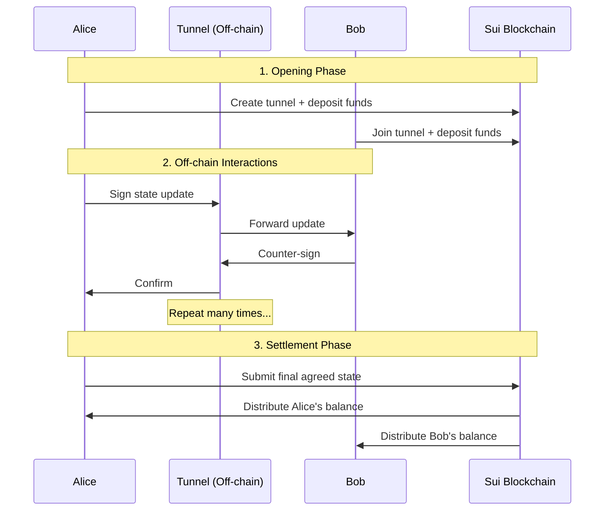
```mermaid
sequenceDiagram
    participant A as Alice
    participant T as Tunnel (Off-chain)
    participant B as Bob
    participant S as Sui Blockchain

    Note over A,S: 1. Opening Phase
    A->>S: Create tunnel + deposit funds
    B->>S: Join tunnel + deposit funds

    Note over A,B: 2. Off-chain Interactions
    A->>T: Sign state update
    T->>B: Forward update
    B->>T: Counter-sign
    T->>A: Confirm
    Note over T: Repeat many times...

    Note over A,S: 3. Settlement Phase
    A->>S: Submit final agreed state
    S->>A: Distribute Alice's balance
    S->>B: Distribute Bob's balance
```

### The Core Idea

1. **Open**: Participants lock funds in an on-chain tunnel object
2. **Interact**: Conduct unlimited off-chain state updates (signed messages)
3. **Close**: Submit the final agreed state to unlock funds according to the outcome

The blockchain only sees the opening and closing transactions, regardless of how many interactions happened in between.

---

## Why Use Tunnels?

### Benefits

| Benefit              | Description                                              |
| -------------------- | -------------------------------------------------------- |
| **Instant Finality** | Off-chain updates are final the moment both parties sign |
| **Zero Gas Fees**    | Intermediate state updates cost nothing                  |
| **High Throughput**  | Thousands of interactions per second between parties     |
| **Privacy**          | Intermediate states never touch the blockchain           |
| **Security**         | Either party can force on-chain settlement at any time   |
| **Flexibility**      | Generic over any token type (`Tunnel<T>`)                |

### When to Use Tunnels

Tunnels are ideal for:

- **Gaming**: Real-time game state updates (card games, chess, etc.)
- **Micropayments**: Streaming payments, pay-per-use services
- **Trading**: High-frequency trading between known parties
- **Subscriptions**: Metered billing with instant updates
- **IoT**: Machine-to-machine payments
- **Any high-frequency bilateral interaction**

### Comparison

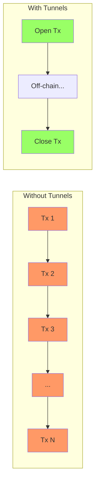
```mermaid
graph LR
    subgraph "Without Tunnels"
        A1[Tx 1] --> B1[Tx 2]
        B1 --> C1[Tx 3]
        C1 --> D1[...]
        D1 --> E1[Tx N]
        style A1 fill:#f96
        style B1 fill:#f96
        style C1 fill:#f96
        style D1 fill:#f96
        style E1 fill:#f96
    end

    subgraph "With Tunnels"
        A2[Open Tx] --> B2[Off-chain...]
        B2 --> C2[Close Tx]
        style A2 fill:#9f6
        style C2 fill:#9f6
    end
```

**Without tunnels**: N transactions = N gas fees + N block confirmations

**With tunnels**: 2 transactions = 2 gas fees, unlimited off-chain interactions

---

## Architecture Overview

The Sui Tunnel Framework is organized into **independent, composable modules**:

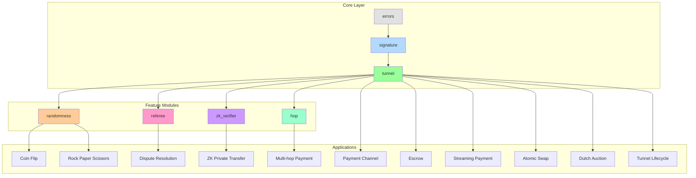
```mermaid
graph TB
    subgraph "Core Layer"
        E[errors] --> S[signature]
        S --> T[tunnel]
    end

    subgraph "Feature Modules"
        T --> R[randomness]
        T --> RF[referee]
        T --> ZK[zk_verifier]
        T --> H[hop]
    end

    subgraph "Applications"
        T --> EX1[Payment Channel]
        R --> EX2[Coin Flip]
        H --> EX3[Multi-hop Payment]
        T --> EX4[Escrow]
        R --> EX5[Rock Paper Scissors]
        T --> EX6[Streaming Payment]
        T --> EX7[Atomic Swap]
        T --> EX8[Dutch Auction]
        T --> EX9[Tunnel Lifecycle]
        RF --> EX10[Dispute Resolution]
        ZK --> EX11[ZK Private Transfer]
    end

    style E fill:#e1e1e1
    style S fill:#b3d9ff
    style T fill:#99ff99
    style R fill:#ffcc99
    style RF fill:#ff99cc
    style ZK fill:#cc99ff
    style H fill:#99ffcc
```

---

## Core Modules

### 1. `errors` - Error Handling

**Purpose**: Centralized error codes for the entire framework.

**Key Features**:

- Organized by category (general, signature, tunnel, state, randomness, referee, ZK, hop, balance)
- Each error has a unique numeric code for debugging
- Public getter functions for all error codes

**Error Code Ranges**:
| Range | Category |
|-------|----------|
| 0-99 | General errors |
| 100-199 | Signature errors |
| 200-299 | Tunnel lifecycle errors |
| 300-399 | State management errors |
| 400-499 | Randomness errors |
| 500-599 | Referee/Dispute errors |
| 600-699 | ZK verification errors |
| 700-799 | Multi-hop routing errors |
| 800-899 | Balance/Payment errors |

---

### 2. `signature` - Multi-Scheme Signature Verification

**Purpose**: Unified interface for verifying cryptographic signatures across multiple schemes.

**Supported Signature Types**:

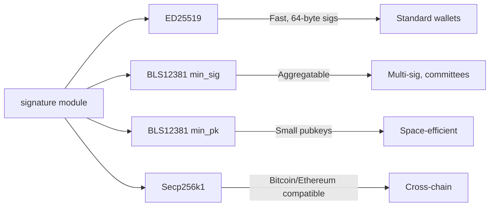
```mermaid
graph LR
    SIG[signature module] --> ED[ED25519]
    SIG --> BLS1[BLS12381 min_sig]
    SIG --> BLS2[BLS12381 min_pk]
    SIG --> SECP[Secp256k1]

    ED --> |"Fast, 64-byte sigs"| W1[Standard wallets]
    BLS1 --> |"Aggregatable"| W2[Multi-sig, committees]
    BLS2 --> |"Small pubkeys"| W3[Space-efficient]
    SECP --> |"Bitcoin/Ethereum compatible"| W4[Cross-chain]
```

**Key Functions**:

```move
// Verify a signature with automatic scheme detection
signature::verify(
    signature_type: u8,
    public_key: &vector<u8>,
    message: &vector<u8>,
    signature: &vector<u8>
): bool

// Message construction helpers
signature::construct_message(domain: vector<u8>, tunnel_id: vector<u8>, nonce: u64, payload: vector<u8>): vector<u8>
```

**Why Multiple Schemes?**

- **ED25519**: Default for Sui wallets, fast verification
- **BLS12381**: Signature aggregation for committees, verifiable randomness
- **Secp256k1**: Compatibility with Bitcoin/Ethereum ecosystems

---

### 3. `tunnel` - Core State Channel Primitive

**Purpose**: The foundational building block for all tunnel-based applications.

**Lifecycle**:

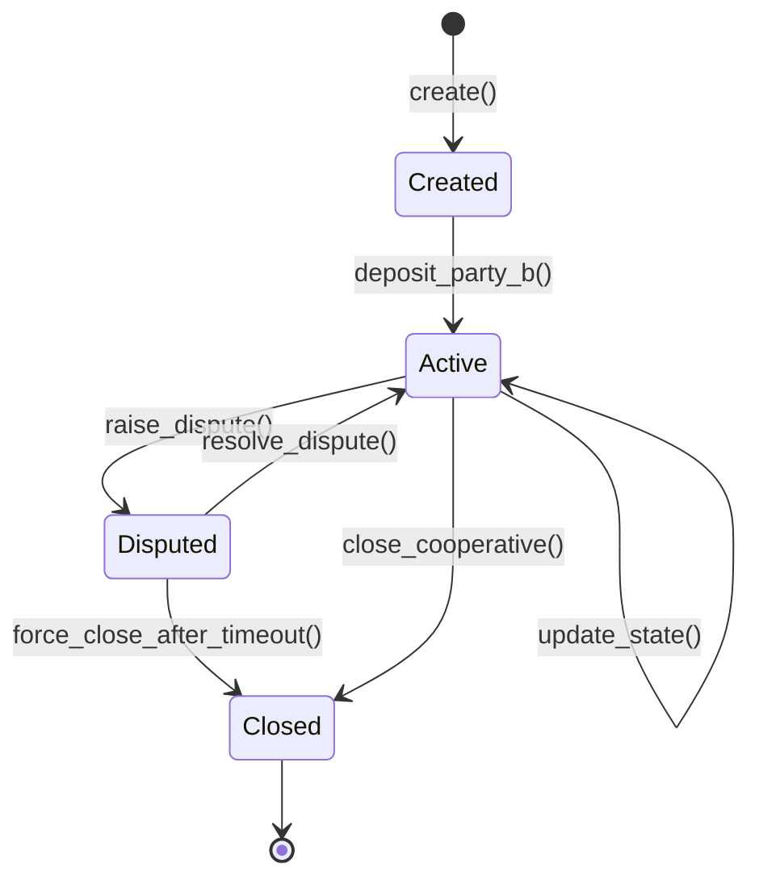
```mermaid
stateDiagram-v2
    [*] --> Created: create()
    Created --> Active: deposit_party_b()
    Active --> Active: update_state()
    Active --> Disputed: raise_dispute()
    Disputed --> Active: resolve_dispute()
    Disputed --> Closed: force_close_after_timeout()
    Active --> Closed: close_cooperative()
    Closed --> [*]
```

**Key Struct**:

```move
public struct Tunnel<phantom T> has key, store {
    id: UID,
    party_a: PartyConfig,      // First party's config
    party_b: PartyConfig,      // Second party's config
    balance: Balance<T>,       // Combined deposits from both parties
    party_a_deposit: u64,      // Amount deposited by party A
    party_b_deposit: u64,      // Amount deposited by party B
    status: u8,                // Created/Active/Closed/Disputed
    state: StateCommitment,    // Latest committed state
    created_at: u64,           // Creation timestamp
    last_activity: u64,        // Timestamp of last activity
    timeout_ms: u64,           // Timeout duration in milliseconds
    penalty_amount: u64,       // Penalty for uncooperative behavior
    dispute_raiser: address,   // Who raised the current dispute
}
```

**Key Operations**:

| Operation                     | Description                               |
| ----------------------------- | ----------------------------------------- |
| `create()`                    | Create a new tunnel between two parties   |
| `deposit_party_a/b()`         | Lock funds in the tunnel                  |
| `update_state()`              | Update the off-chain state commitment     |
| `close_cooperative()`         | Both parties agree to close               |
| `raise_dispute()`             | One party disputes the current state      |
| `resolve_dispute()`           | Counter a dispute with newer signed state |
| `force_close_after_timeout()` | Force close after dispute timeout         |

**Security Features**:

- Dual-signature requirement for state updates
- Nonce-based replay protection
- Timeout-based dispute resolution
- Domain-separated signatures

---

### 4. `randomness` - Verifiable Randomness

**Purpose**: Generate fair, unpredictable random values that both parties can verify.

**Two Approaches**:

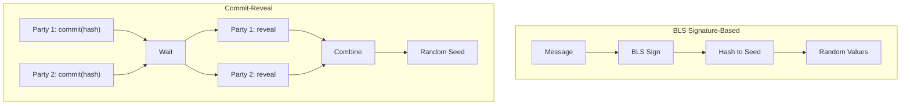
```mermaid
graph TB
    subgraph "BLS Signature-Based"
        MSG[Message] --> BLS[BLS Sign]
        BLS --> HASH[Hash to Seed]
        HASH --> RAND1[Random Values]
    end

    subgraph "Commit-Reveal"
        P1["Party 1: commit(hash)"] --> WAIT[Wait]
        P2["Party 2: commit(hash)"] --> WAIT
        WAIT --> R1[Party 1: reveal]
        WAIT --> R2[Party 2: reveal]
        R1 --> COMBINE[Combine]
        R2 --> COMBINE
        COMBINE --> RAND2[Random Seed]
    end
```

**Key Structs**:

```move
public struct Seed { bytes: vector<u8>, counter: u64 }
public struct Commitment { hash: vector<u8>, committer: address, timestamp: u64 }
public struct Reveal { value: vector<u8>, salt: vector<u8> }
```

**Key Functions**:

```move
// Create seed from BLS signature (dealer-based)
randomness::from_bls_signature(message: &vector<u8>, signature: &vector<u8>): Seed

// Commit-reveal flow
randomness::create_commitment(value_hash: vector<u8>, committer: address, timestamp: u64): Commitment
randomness::create_reveal(value: vector<u8>, salt: vector<u8>): Reveal
randomness::combine_reveals(reveal_a: &Reveal, reveal_b: &Reveal): Seed

// Random value generation
randomness::next_u64(seed: &Seed): (u64, Seed)
randomness::next_u64_in_range(seed: &Seed, min: u64, max: u64): (u64, Seed)
randomness::shuffle<T>(seed: &Seed, vec: &mut vector<T>): Seed
```

**Use Cases**:

- Card games (shuffling, dealing)
- Dice rolls
- Lottery/raffle selection
- Any game requiring provably fair randomness

---

### 5. `referee` - Dispute Resolution

**Purpose**: Handle disputes when parties disagree on the tunnel state.

**Dispute Flow**:

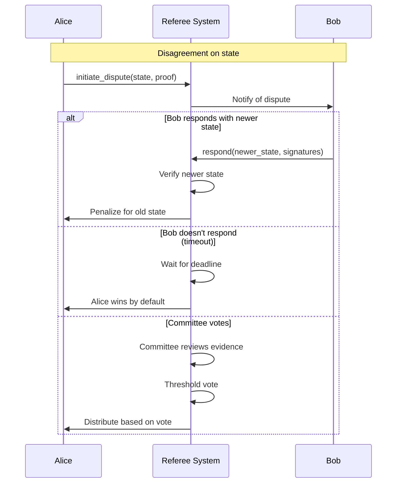
```mermaid
sequenceDiagram
    participant A as Alice
    participant R as Referee System
    participant B as Bob

    Note over A,B: Disagreement on state
    A->>R: initiate_dispute(state, proof)
    R->>B: Notify of dispute

    alt Bob responds with newer state
        B->>R: respond(newer_state, signatures)
        R->>R: Verify newer state
        R->>A: Penalize for old state
    else Bob doesn't respond (timeout)
        R->>R: Wait for deadline
        R->>A: Alice wins by default
    else Committee votes
        R->>R: Committee reviews evidence
        R->>R: Threshold vote
        R->>A: Distribute based on vote
    end
```

**Key Structs**:

```move
public struct RefereeConfig {
    timeout_ms: u64,           // Dispute response timeout
    penalty_rate_bps: u64,     // Penalty in basis points (100 = 1%)
    min_dispute_stake: u64,    // Minimum stake to dispute
}

public struct Dispute {
    id: UID,
    disputer: address,
    tunnel_id: vector<u8>,
    claimed_state: vector<u8>,
    evidence: vector<u8>,
    deadline: u64,
    status: u8,
}

public struct Committee {
    members: vector<address>,
    threshold: u64,            // Votes needed for decision
    votes: VecMap<address, Vote>,
}
```

**Key Functions**:

```move
referee::create_config(timeout_ms: u64, penalty_rate_bps: u64, min_stake: u64): RefereeConfig
referee::create_dispute(...): Dispute
referee::respond_to_dispute(...)
referee::create_committee(members: vector<address>, threshold: u64): Committee
referee::cast_vote(committee: &mut Committee, voter: address, in_favor: bool, reason: vector<u8>)
referee::calculate_penalty(amount: u64, rate_bps: u64): u64
```

---

### 6. `zk_verifier` - Zero-Knowledge Proof Verification

**Purpose**: Verify Groth16 zero-knowledge proofs for privacy-preserving state transitions.

**How It Works**:

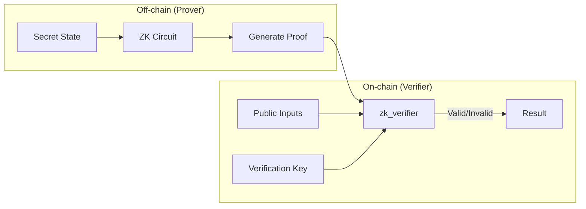
```mermaid
graph LR
    subgraph "Off-chain (Prover)"
        S[Secret State] --> C[ZK Circuit]
        C --> P[Generate Proof]
    end

    subgraph "On-chain (Verifier)"
        P --> V[zk_verifier]
        PUB[Public Inputs] --> V
        VK[Verification Key] --> V
        V --> |"Valid/Invalid"| R[Result]
    end
```

**Supported Curves**:

- **BLS12-381**: Standard for many ZK systems
- **BN254**: Compatible with Ethereum's ZK ecosystem

**Key Structs**:

```move
public struct Circuit {
    id: vector<u8>,
    curve: u8,                 // BLS12381 or BN254
    verification_key: vector<u8>,
    public_input_count: u64,
    description: vector<u8>,
}

public struct CircuitRegistry {
    circuits: Table<vector<u8>, Circuit>,
}

public struct VerificationResult {
    circuit_id: vector<u8>,
    is_valid: bool,
    public_inputs_hash: vector<u8>,
    verified_at: u64,
}
```

**Key Functions**:

```move
// Register a circuit
zk_verifier::register_circuit(
    registry: &mut CircuitRegistry,
    id: vector<u8>,
    curve: u8,
    vk: vector<u8>,
    input_count: u64,
    ctx: &mut TxContext
)

// Verify a proof
zk_verifier::verify_groth16_bls12381(
    vk: &vector<u8>,
    public_inputs: &vector<u8>,
    proof: &vector<u8>
): bool
```

**Use Cases**:

- Private balance updates (hide exact amounts)
- Anonymous voting
- Proving game moves without revealing strategy
- Compliance proofs (prove you meet criteria without revealing data)

---

### 7. `hop` - Multi-Hop Routing

**Purpose**: Enable payments across multiple tunnels using Hash Time-Locked Contracts (HTLCs), similar to the Lightning Network.

**How Multi-Hop Works**:

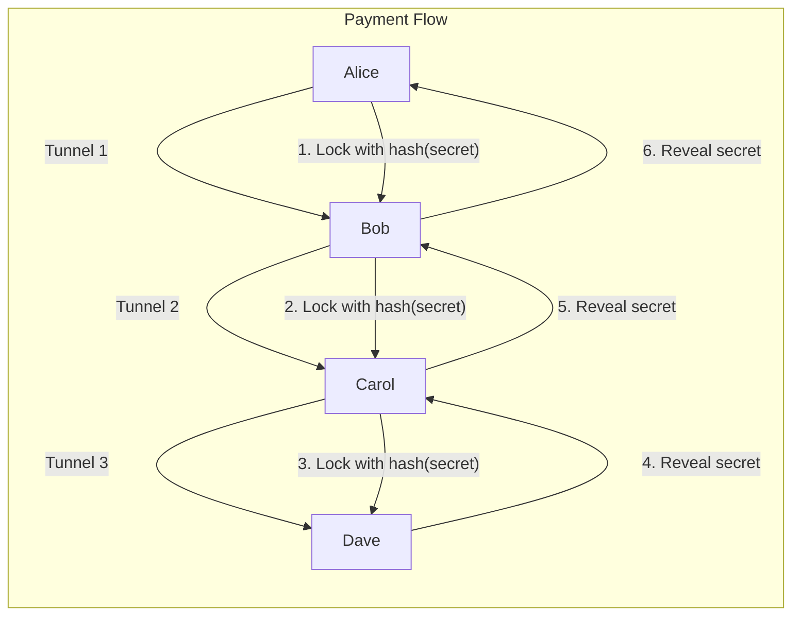
```mermaid
graph LR
    A[Alice] -->|"Tunnel 1"| B[Bob]
    B -->|"Tunnel 2"| C[Carol]
    C -->|"Tunnel 3"| D[Dave]

    subgraph "Payment Flow"
        A -->|"1. Lock with hash(secret)"| B
        B -->|"2. Lock with hash(secret)"| C
        C -->|"3. Lock with hash(secret)"| D
        D -->|"4. Reveal secret"| C
        C -->|"5. Reveal secret"| B
        B -->|"6. Reveal secret"| A
    end
```

**HTLC Lifecycle**:

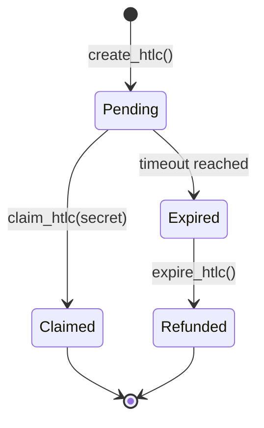
```mermaid
stateDiagram-v2
    [*] --> Pending: create_htlc()
    Pending --> Claimed: claim_htlc(secret)
    Pending --> Expired: timeout reached
    Expired --> Refunded: expire_htlc()
    Claimed --> [*]
    Refunded --> [*]
```

**Key Structs**:

```move
public struct HTLC has drop, store {
    id: vector<u8>,            // Unique identifier
    payment_hash: vector<u8>,  // Hash of the preimage
    amount: u64,               // Amount locked
    sender: address,           // Who locked the funds
    receiver: address,         // Who can claim with preimage
    expiry_ms: u64,            // Expiry timestamp
    status: u8,                // Pending/Claimed/Expired/Cancelled
    preimage: vector<u8>,      // Revealed preimage (once claimed)
}

public struct Route has copy, drop, store {
    id: vector<u8>,            // Unique route identifier
    sender: address,           // Sender address
    receiver: address,         // Final receiver address
    amount: u64,               // Amount to transfer (before fees)
    hops: vector<Hop>,         // List of hops in order
    total_fees: u64,           // Total fees across all hops
    status: u8,                // Planning/Active/Completed/Failed
    created_at: u64,           // Creation timestamp
}

public struct FeePolicy {
    base_fee: u64,             // Fixed fee per hop
    fee_rate_bps: u64,         // Percentage fee (basis points)
}
```

**Key Functions**:

```move
hop::create_htlc(payment_hash: vector<u8>, amount: u64, sender: address, receiver: address, expiry_ms: u64): HTLC
hop::claim_htlc(htlc: &mut HTLC, preimage: vector<u8>): bool
hop::expire_htlc(htlc: &mut HTLC, current_time: u64): bool
hop::validate_route(route: &Route): RouteValidation
hop::create_cascading_timeouts(base_timeout: u64, hop_count: u64, delta: u64): vector<u64>
```

**Use Cases**:

- Cross-tunnel payments
- Payment routing networks
- Atomic multi-party swaps

---

## Example Applications

The framework includes 11 complete example applications demonstrating various patterns:

### 1. `example_payment_channel` - Bidirectional Payments

**What it does**: A simple payment channel where two parties can send payments back and forth.

**Modules used**: `tunnel`, `signature`, `errors`

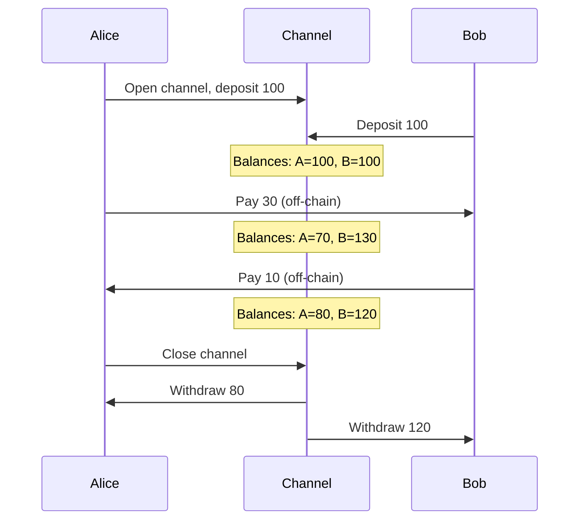
```mermaid
sequenceDiagram
    participant A as Alice
    participant C as Channel
    participant B as Bob

    A->>C: Open channel, deposit 100
    B->>C: Deposit 100
    Note over C: Balances: A=100, B=100

    A->>B: Pay 30 (off-chain)
    Note over C: Balances: A=70, B=130

    B->>A: Pay 10 (off-chain)
    Note over C: Balances: A=80, B=120

    A->>C: Close channel
    C->>A: Withdraw 80
    C->>B: Withdraw 120
```

**Key Pattern**: Accumulating balance changes off-chain, settling final balances on-chain.

---

### 2. `example_coin_flip` - Fair Randomness Game

**What it does**: A provably fair coin flip where neither party can cheat.

**Modules used**: `randomness`, `errors`

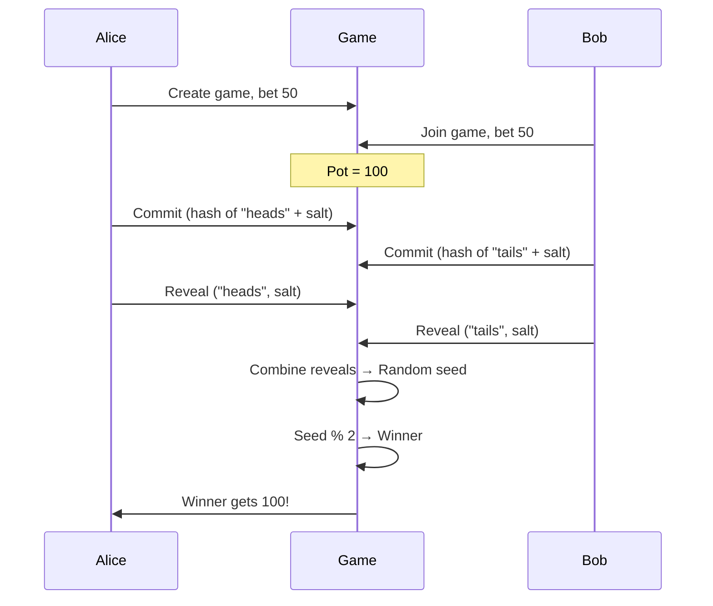
```mermaid
sequenceDiagram
    participant A as Alice
    participant G as Game
    participant B as Bob

    A->>G: Create game, bet 50
    B->>G: Join game, bet 50
    Note over G: Pot = 100

    A->>G: Commit (hash of "heads" + salt)
    B->>G: Commit (hash of "tails" + salt)

    A->>G: Reveal ("heads", salt)
    B->>G: Reveal ("tails", salt)

    G->>G: Combine reveals → Random seed
    G->>G: Seed % 2 → Winner
    G->>A: Winner gets 100!
```

**Key Pattern**: Commit-reveal prevents either party from choosing their value after seeing the opponent's.

---

### 3. `example_multi_hop_payment` - Lightning-Style Routing

**What it does**: Send a payment across multiple tunnels atomically.

**Modules used**: `hop`, `tunnel`, `errors`

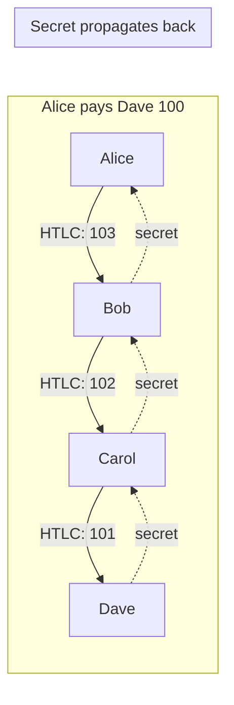
```mermaid
graph LR
    subgraph "Alice pays Dave 100"
        A[Alice] -->|"HTLC: 103"| B[Bob]
        B -->|"HTLC: 102"| C[Carol]
        C -->|"HTLC: 101"| D[Dave]
    end

    subgraph "Secret propagates back"
        D -.->|"secret"| C
        C -.->|"secret"| B
        B -.->|"secret"| A
    end
```

**Key Pattern**: HTLCs with cascading timeouts ensure atomic settlement across all hops.

---

### 4. `example_escrow` - Conditional Payments

**What it does**: Hold funds until conditions are met (delivery confirmation, dispute resolution).

**Modules used**: `tunnel`, `errors`

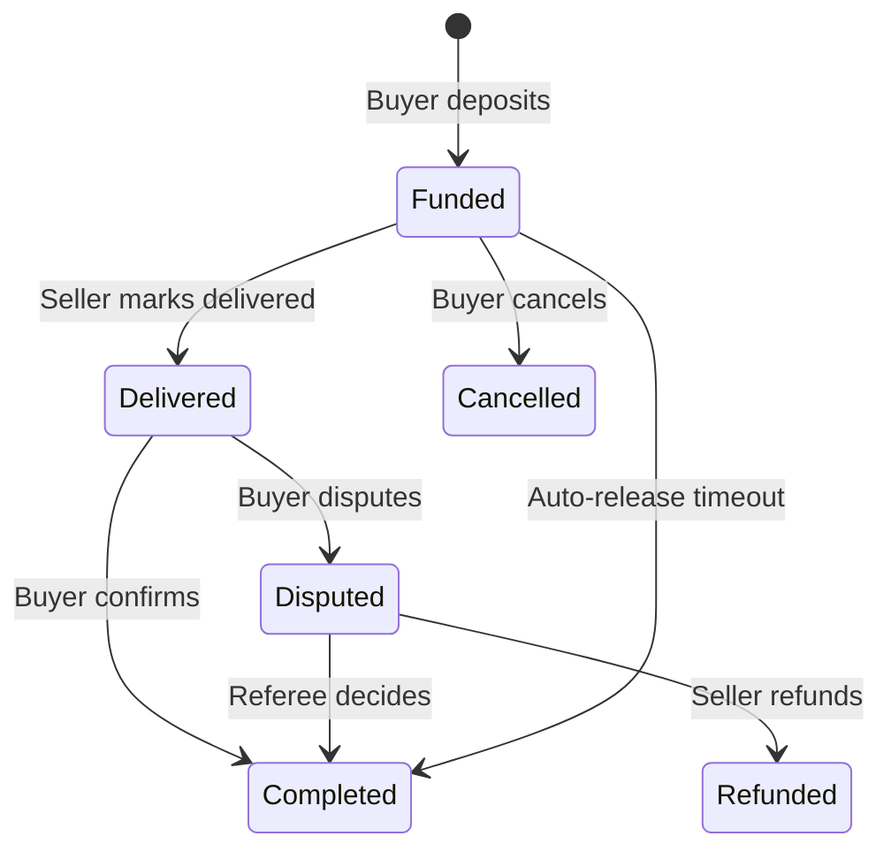
```mermaid
stateDiagram-v2
    [*] --> Funded: Buyer deposits
    Funded --> Delivered: Seller marks delivered
    Delivered --> Completed: Buyer confirms
    Delivered --> Disputed: Buyer disputes
    Disputed --> Refunded: Seller refunds
    Disputed --> Completed: Referee decides
    Funded --> Completed: Auto-release timeout
    Funded --> Cancelled: Buyer cancels
```

**Key Pattern**: Time-locked automatic release protects against unresponsive parties.

---

### 5. `example_rock_paper_scissors` - Commit-Reveal Game

**What it does**: Fair two-player game where moves are hidden until both commit.

**Modules used**: `randomness`, `errors`

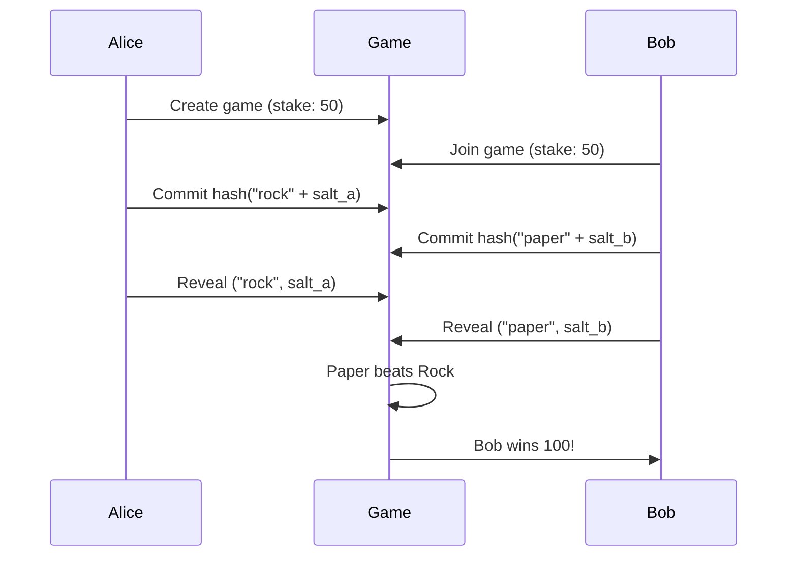
```mermaid
sequenceDiagram
    participant A as Alice
    participant G as Game
    participant B as Bob

    A->>G: Create game (stake: 50)
    B->>G: Join game (stake: 50)

    A->>G: Commit hash("rock" + salt_a)
    B->>G: Commit hash("paper" + salt_b)

    A->>G: Reveal ("rock", salt_a)
    B->>G: Reveal ("paper", salt_b)

    G->>G: Paper beats Rock
    G->>B: Bob wins 100!
```

**Key Pattern**: Neither player can change their move after seeing the opponent's commit.

---

### 6. `example_streaming_payment` - Time-Based Payments

**What it does**: Funds unlock linearly over time (like salary streaming).

**Modules used**: `tunnel`, `errors`

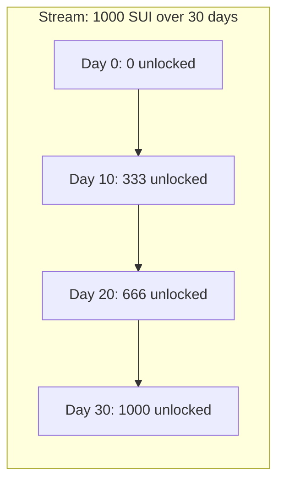
```mermaid
graph LR
    subgraph "Stream: 1000 SUI over 30 days"
        T0[Day 0: 0 unlocked] --> T10[Day 10: 333 unlocked]
        T10 --> T20[Day 20: 666 unlocked]
        T20 --> T30[Day 30: 1000 unlocked]
    end
```

**Key Pattern**: `calculate_unlocked(current_time)` determines withdrawable amount at any moment.

```
unlocked = total_amount * (elapsed_time / total_duration)
```

---

### 7. `example_atomic_swap` - Trustless Exchange

**What it does**: Exchange assets between two parties without trusting each other.

**Modules used**: `hop` (HTLC pattern), `errors`

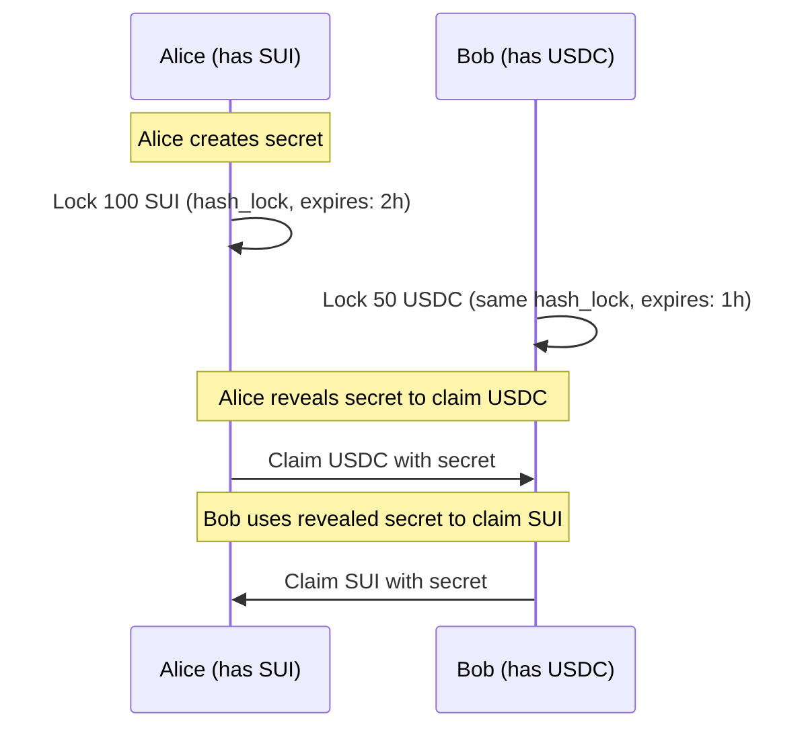
```mermaid
sequenceDiagram
    participant A as Alice (has SUI)
    participant B as Bob (has USDC)

    Note over A: Alice creates secret
    A->>A: Lock 100 SUI (hash_lock, expires: 2h)
    B->>B: Lock 50 USDC (same hash_lock, expires: 1h)

    Note over A,B: Alice reveals secret to claim USDC
    A->>B: Claim USDC with secret

    Note over A,B: Bob uses revealed secret to claim SUI
    B->>A: Claim SUI with secret
```

**Key Pattern**: Cascading timeouts (Alice's lock expires after Bob's) ensure fairness.

---

### 8. `example_dutch_auction` - Descending Price Sale

**What it does**: Price drops over time until someone buys.

**Modules used**: `tunnel`, `errors`

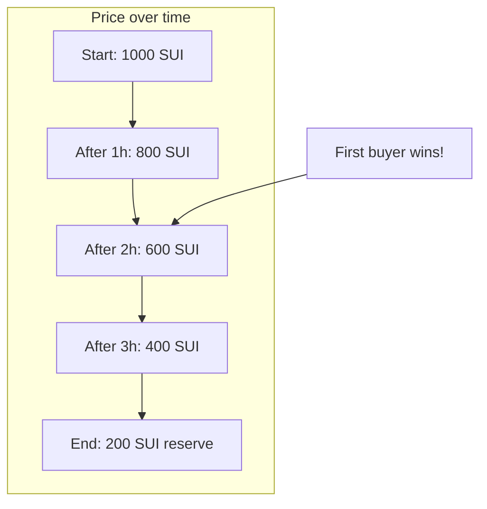
```mermaid
graph TB
    subgraph "Price over time"
        P1[Start: 1000 SUI] --> P2[After 1h: 800 SUI]
        P2 --> P3[After 2h: 600 SUI]
        P3 --> P4[After 3h: 400 SUI]
        P4 --> P5[End: 200 SUI reserve]
    end

    BUY[First buyer wins!] --> P3
```

**Key Pattern**: `calculate_price(current_time)` returns the current price based on linear interpolation.

---

### 9. `example_tunnel_lifecycle` - Full Tunnel Lifecycle

**What it does**: Demonstrates the complete lifecycle of the core `tunnel` module through a micropayment session.

**Modules used**: `tunnel`, `signature`, `errors`

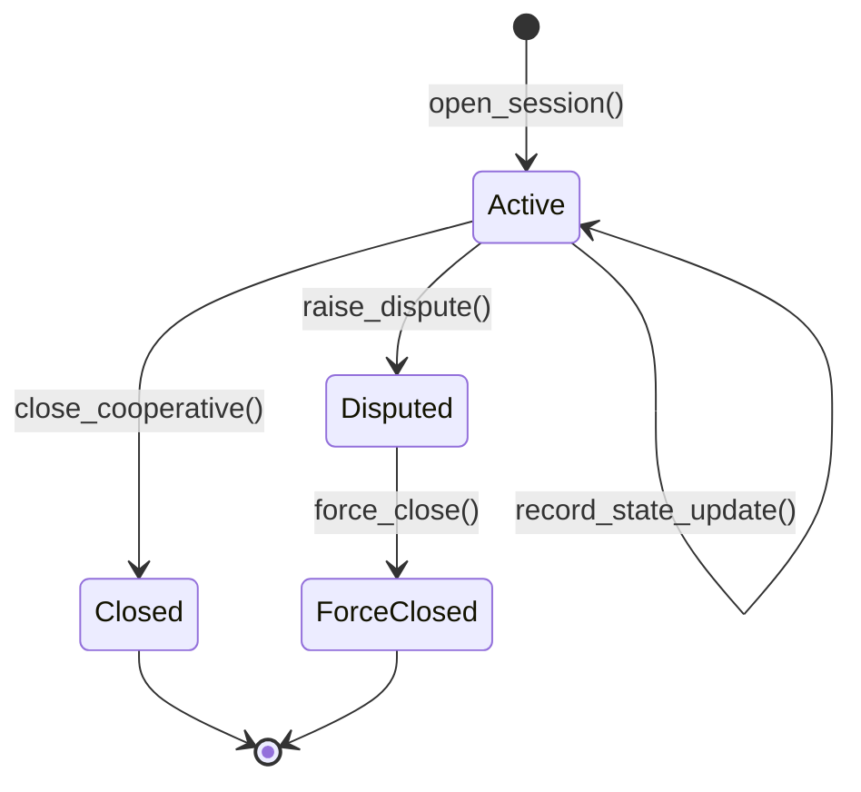
```mermaid
stateDiagram-v2
    [*] --> Active: open_session()
    Active --> Active: record_state_update()
    Active --> Closed: close_cooperative()
    Active --> Disputed: raise_dispute()
    Disputed --> ForceClosed: force_close()
    Closed --> [*]
    ForceClosed --> [*]
```

**Key Pattern**: Wraps the core `tunnel` module with application-specific state (micropayment totals, rate limiting, memos).

---

### 10. `example_dispute_resolution` - Referee & Disputes

**What it does**: Shows configurable dispute resolution with service level presets, graduated penalties, and committee voting.

**Modules used**: `referee`, `errors`

```
Service Levels:
  Basic    → 24h timeout, no penalties
  Standard → 4h timeout, moderate penalties, grace period
  Premium  → 1h timeout, steep penalties, committee arbitration
```

**Key Pattern**: `calculate_penalty()` applies graduated penalties based on dispute history (repeat offenders pay more).

---

### 11. `example_zk_private_transfer` - ZK-Verified Transfers

**What it does**: Demonstrates private transfers using the `zk_verifier` module for zero-knowledge proof verification.

**Modules used**: `zk_verifier`, `errors`

Three circuit types:

- **balance_transfer**: Proves a transfer is valid without revealing amounts
- **range_proof**: Proves a value is within a range without revealing it
- **ownership_proof**: Proves ownership of an address without revealing private key

**Key Pattern**: Build public inputs using `u64_to_scalar`, `address_to_scalar`, `concat_scalars`, then verify against registered circuits.

---

## Modular Design

### Mix and Match

Each module is **independent** and can be used alone or combined with others:

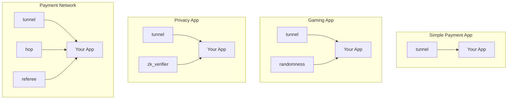
```mermaid
graph TB
    subgraph "Simple Payment App"
        T1[tunnel] --> A1[Your App]
    end

    subgraph "Gaming App"
        T2[tunnel] --> A2[Your App]
        R2[randomness] --> A2
    end

    subgraph "Privacy App"
        T3[tunnel] --> A3[Your App]
        ZK3[zk_verifier] --> A3
    end

    subgraph "Payment Network"
        T4[tunnel] --> A4[Your App]
        H4[hop] --> A4
        RF4[referee] --> A4
    end
```

### Module Dependencies

| If you need...       | Use these modules               |
| -------------------- | ------------------------------- |
| Basic state channels | `tunnel`, `signature`, `errors` |
| Fair randomness      | + `randomness`                  |
| Dispute handling     | + `referee`                     |
| Privacy              | + `zk_verifier`                 |
| Multi-hop routing    | + `hop`                         |

### Minimal Example

For the simplest use case (basic payment channel), you only need:

```move
use sui_tunnel::tunnel;
use sui_tunnel::signature;
use sui_tunnel::errors;

// Create a tunnel
let tunnel = tunnel::create<SUI>(
    party_a_addr, party_a_pk, signature::ed25519(),
    party_b_addr, party_b_pk, signature::ed25519(),
    timeout_ms, penalty_amount,
    &clock, ctx
);

// Both parties deposit funds
tunnel::deposit_party_a(&mut tunnel, coin_a, &clock, ctx);
tunnel::deposit_party_b(&mut tunnel, coin_b, &clock, ctx);

// ... off-chain interactions ...

// Close cooperatively
let (coin_a, coin_b) = tunnel::close_cooperative(
    &mut tunnel, final_a, final_b, sig_a, sig_b, &clock, ctx
);
```

---

## High-Throughput Off-Chain Framework (1M+ effective TPS)

The TypeScript SDK includes an experimental framework that drives **millions of off-chain,
dual-signed, mutually-verified tunnel state transitions per second** ("effective TPS"). Opening
and closing a tunnel are on-chain transactions; every interaction in between is an off-chain,
cryptographically-signed state update — so the throughput is **off-chain** (anchored by ~2 on-chain
txs to open and 1 to settle per tunnel), **not** Sui consensus TPS.

Highlights:

- **Generic protocol abstraction** — Payments, Blackjack, Tic-Tac-Toe, Chat, and **Quantum Poker**
  (dealerless commit-reveal shuffle + hidden hole cards, with a dispute-time Groth16 fairness circuit).
- **Multi-core simulator + activity generator** with a worker-thread cluster; a native `node:crypto`
  ed25519 backend (~15× faster verification than pure JS) is the default.
- **Autonomous agents** (discover → open → interact → settle), **telemetry** (JSON/CSV), a
  **watchtower** for automatic dispute/timeout recovery, **proof-of-existence** transcripts with a
  Merkle root anchored on-chain (Walrus-pluggable storage), and a reproducible **benchmark harness**.
- **Cross-language correctness** — the off-chain wire format, commit-reveal, shuffle, and ZK
  public-inputs are proven byte-identical to Move by golden tests (including an on-chain check that an
  SDK-signed update is accepted by `signature::verify`).

```bash
cd sui-tunnel-ts && pnpm install
pnpm test                                               # 140+ unit + cross-language tests
node --import tsx src/examples/offchainDemo.ts          # end-to-end demo (no chain needed)
node --import tsx src/bench/cli.ts --agents 200 --tunnels 1000 --updates-per-tunnel 300
```

Design, results, and the recommended public-event configuration:
[`sui-tunnel-ts/docs/DESIGN_REVIEW.md`](sui-tunnel-ts/docs/DESIGN_REVIEW.md),
[`PERFORMANCE_REPORT.md`](sui-tunnel-ts/docs/PERFORMANCE_REPORT.md),
[`QUANTUM_POKER.md`](sui-tunnel-ts/docs/QUANTUM_POKER.md).

---

## Repository Structure

```
sui-tunnel/
├── sui_tunnel/                    # Core framework (Move smart contracts)
│   ├── sources/                   # Module source files
│   │   ├── tunnel.move            # Core state channel primitive
│   │   ├── signature.move         # Multi-scheme signature verification
│   │   ├── errors.move            # Centralized error codes
│   │   ├── randomness.move        # Verifiable randomness
│   │   ├── referee.move           # Dispute resolution
│   │   ├── zk_verifier.move       # Zero-knowledge proof verification
│   │   ├── hop.move               # Multi-hop routing (HTLCs)
│   │   └── examples/              # 11 example applications
│   │       ├── example_payment_channel.move
│   │       ├── example_escrow.move
│   │       └── ...
│   ├── tests/                     # All tests (28 files, 384 tests)
│   │   ├── tunnel_tests.move
│   │   ├── example_escrow_tests.move
│   │   ├── sui_tunnel_tests.move  # Cross-module integration tests
│   │   └── ...
│   └── Move.toml
└── sui-tunnel-ts/                 # TypeScript SDK
```

| Directory                          | Description                                                    |
| ---------------------------------- | -------------------------------------------------------------- |
| [`sui_tunnel/`](sui_tunnel/)       | Core Move framework with 7 modules and 11 example applications |
| [`sui-tunnel-ts/`](sui-tunnel-ts/) | TypeScript SDK with type-safe bindings for all example modules |

## Getting Started

### Prerequisites

- [Sui CLI](https://docs.sui.io/build/install) (includes the Move compiler)
- [Node.js](https://nodejs.org/) >= 20 and [pnpm](https://pnpm.io/) (for TypeScript SDK)

### Move Contracts

```bash
cd sui_tunnel
sui move build
sui move test
```

### TypeScript SDK

```bash
cd sui-tunnel-ts
cp .env.example .env   # Configure PACKAGE_ID, network, etc.
pnpm install
pnpm build
```

### Use in Your Own Project

Add to your `Move.toml`:

```toml
[dependencies]
SuiTunnel = { git = "https://github.com/MystenLabs/sui-tunnel.git", subdir = "sui_tunnel" }
```

Then import the modules you need:

```move
use sui_tunnel::tunnel;
use sui_tunnel::randomness;
// ... etc
```

> **Note**: 8 of the 11 example modules are generic over coin type (`phantom T`). When calling them with SUI, pass the type argument `0x2::sui::SUI`. You can use any coin type that implements the Sui `Coin` standard.

---

## Testing

The framework includes comprehensive tests:

```bash
# Run all tests (384 tests)
cd sui_tunnel
sui move test

# Run tests matching a filter (positional argument)
sui move test test_tunnel_lifecycle

# Run tests with a gas limit per test
sui move test --gas-limit 1000000000
```

All tests live in the `sui_tunnel/tests/` directory (28 test files), keeping source modules clean. Test categories:

- **Core module tests**: `tunnel_tests`, `signature_tests`, `errors_tests`, `hop_tests`, `referee_tests`, `randomness_tests`, `zk_verifier_tests`
- **Example application tests**: One test file per example (e.g., `example_escrow_tests`, `example_coin_flip_tests`)
- **Integration tests**: `sui_tunnel_tests` — cross-module scenarios
- **Cross-language golden tests**: `wire_format_tests`, `randomness_xcheck_tests`, `zk_inputs_xcheck_tests` — prove the off-chain SDK's serialization, commit-reveal, shuffle, and ZK public-inputs are byte-identical to Move

The TypeScript SDK has its own suite (`cd sui-tunnel-ts && pnpm test`, 140+ tests via `node:test`).

---

## Security Considerations

The framework has gone through multiple rounds of security hardening:

1. **Signature Verification**: All state updates require dual-signature verification before acceptance
2. **Nonce Checking**: Strictly increasing nonces prevent replay attacks
3. **Timeout Management**: Configurable timeouts for disputes, HTLCs, and session inactivity
4. **Domain Separation**: Each message type uses a unique domain prefix (e.g., `sui_tunnel::settlement`, `sui_tunnel::state_update`)
5. **Balance Invariants**: Total balances are preserved across state transitions; deposits and withdrawals are checked
6. **Authorization Checks**: Force-close, dispute, and voting operations validate caller identity
7. **Vote Deduplication**: Committee members cannot vote twice on the same dispute
8. **Generic Coin Safety**: Modules use `phantom T` to ensure type safety across different coin types
9. **Option-based Addresses**: Optional fields use `Option<address>` instead of sentinel values (`@0x0`)

---

## Contributing

Contributions are welcome! Please see [CONTRIBUTING.md](CONTRIBUTING.md) for guidelines.

---

## License

Apache-2.0. See [LICENSE](LICENSE) for details.

---

## Acknowledgments

Inspired by:

- Lightning Network (Bitcoin)
- State Channels (Ethereum)
- Payment Channels research

Built on [Sui](https://sui.io) blockchain.
