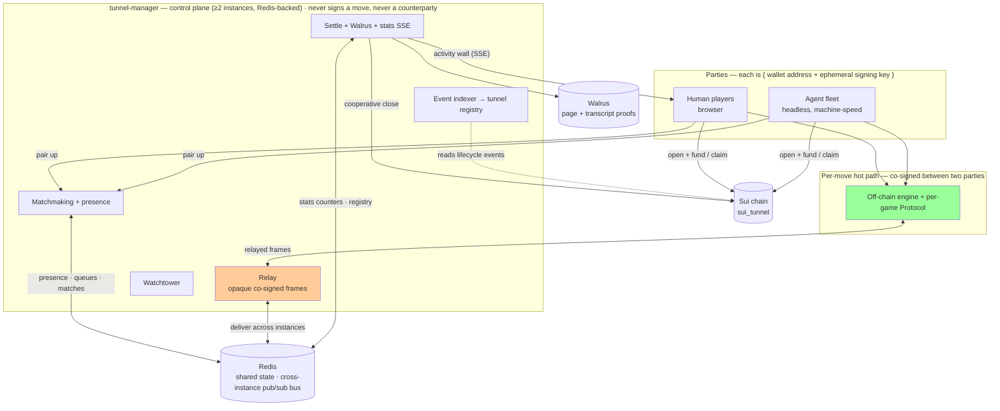
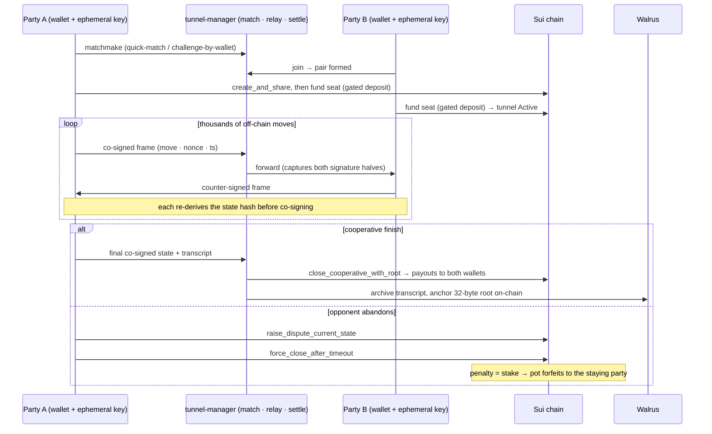

# Dopamint Arena — System Design

Dopamint Arena is a Walrus-published page where visitors connect a Sui wallet and
are automatically paired — with another visitor or with an **independent agent**
(its own wallet + ephemeral key) — into a **two-party Sui tunnel**. The pair locks stakes on-chain, exchanges thousands of
dual-signed, mutually-verified state updates **off-chain** (a hand of blackjack, a
payment stream, a chat, …) for a few minutes, closes the tunnel on-chain, and
optionally archives the full transcript to Walrus as a proof of existence.

Hundreds to thousands of these channels run concurrently. An on-screen activity
wall sums them into a live **effective-TPS** figure; the event targets **millions**
of effective TPS, sourced entirely from genuine two-party play and bounded by real
scale (the achievable figure is measured, never manufactured — see Throughput model).

- **Status**: design of record — July-4 live demo.

---

## Architecture overview



The **green box is the hot path**: the per-move *logic* lives entirely in the two
parties' engines. The relay is a **dumb opaque pipe** on the path — it forwards
frames between the two seats but does no per-move computation, holds no game state,
and cannot read or forge a frame — so it is never a counterparty or a signer, and it
scales horizontally rather than capping the rate. (A swappable P2P transport can drop
the relay from the path entirely; see [Identity, custody & trust](#identity-custody--trust).)

---

## Components

| Component | Responsibility | Never does |
|---|---|---|
| **Browser client** | Wallet connect; mint ephemeral session key; per-game UI; run the off-chain engine; render the activity wall | — |
| **Agent fleet** | Headless parties (own wallet + ephemeral key) that matchmake, fund, play at machine speed, and settle — identical path to a human | Hold a privileged role; bypass the protocol |
| **Off-chain engine** | Drive the per-move loop: `propose` a move; on `receive`, re-derive then co-sign; advance state on confirmation; emit the transcript and its Merkle root | — |
| **Per-game `Protocol`** | Domain logic only: `initialState`, `applyMove`, `encodeState`, `balances`, `isTerminal` | Re-implement signing / settlement / replay protection |
| **tunnel-manager** (control plane) | Matchmaking + presence, opaque-frame relay, watchtower, event-indexed tunnel registry, cooperative settlement, Walrus archival, stats aggregation → SSE | Sign a move · mediate gameplay · hold a bankroll · act as counterparty |
| **Sui chain** | Custody and settlement: open+fund, cooperative/forced close, payouts | See a single in-game move |
| **Walrus** | Host the static page; store full transcripts as proof-of-existence (root anchored on-chain) | Hold funds |

A new game is a new `Protocol` + UI with **zero control-plane change** — the
backend is game-agnostic, keyed only on a `game` id.

---

## Deployment & shared state

The control plane runs as **two or more identical instances behind a load balancer**;
any instance can serve any request. Round-robin routing means a session can register on
one instance and settle on another, and two paired players can land on different
instances — so **all cross-instance state lives in Redis**, never in process memory:

- A **cache cluster** holds the ephemeral key-value state: sessions, presence,
  matchmaking queues, invites, live matches, and the stats counters. Pairing is an
  atomic server-side (Lua) script, so two instances never pair the same waiter.
- A **pub/sub cluster** carries server→client delivery *across* instances: when a
  relayed frame (or a `match.found`) must reach a socket owned by another instance, it
  is published to that instance's channel and delivered locally there. Frames stay
  opaque end to end.
- Each instance keeps only what must be local — its live socket map and its own chain
  indexer (the chain is the source of truth; idempotent folds keep N indexers correct).

There is **no relational database**: every durable fact already lives on-chain
(settlements) or on Walrus (transcripts), and the registry is re-derived from chain
events — the state that remains is non-relational and ephemeral, which is why Redis
alone suffices. Liveness and readiness are split: **`/health/live`** is always 200 while
the process runs; **`/health/ready`** is 200 only when the cache cluster is reachable, so
a pub/sub blip degrades cross-instance PvP delivery but never blacks out stats or
settlement. On-chain settlement pays gas from the settler's **address balance**, so many
cooperative closes submit concurrently without contending on a single gas coin.

---

## Identity, custody & trust

A party is `{ address = real wallet, public_key = ephemeral session key }`, and the
two are stored **independently and never bound**. The wallet locks stakes and
receives payouts; the ephemeral key signs every move. So play is **popup-free**
while funds never leave the wallet's control: the signed state/settlement bytes
carry **no address**, verification uses only the `public_key`, deposits and
unilateral withdrawals are sender-gated to `address`, and payouts are *directed to*
`address` regardless of who submits the closing tx.

The relay is **untrusted**. Because every update is dual-signed and verified by
both parties against the counterparty's `public_key`, a faulty or malicious relay
can only **censor or delay** frames — never forge or alter them. The connect handshake
proves a client controls its ephemeral key (it signs a server-issued nonce); *binding
that key to the claimed wallet — the **wallet attestation** that closes the relay's
key-exchange MITM window — is planned and not yet in v1*. Transport is swappable
(WebSocket first; WebRTC / libp2p later) behind one interface; security does not depend
on it.

Abandonment and stale-state attacks are absorbed by the **dispute + timeout** path,
not by trust. The relay captures **both signature halves** of every frame and retains
the latest co-signed checkpoint — the material a **watchtower** needs to finalize the
true latest state instead of an opponent's stale one. *In v1 the backend captures these
checkpoints; submitting the dispute / force-close on an offline party's behalf is a
follow-up* — today the staying player drives the one-tap claim themselves. The signed
wire format is **byte-identical to the on-chain verifier**:
any update could be submitted and would verify exactly as the chain expects — it
simply isn't, until close.

---

## End-to-end flow



Outcomes are **win-by-play**, **win-by-forfeit** (one-tap claim against an
abandoning opponent), or **genuine-refund** (a true tie or no moves played). There
is no player-facing dispute/draw UI. A trusted on-chain referee — which would make
winner-take-all robust against a spiteful loser who forces a refund — is a later
addition, not part of this design.

---

## Play topology — genuine two-party only

Every tunnel is **two independent parties**, each holding only its *own* ephemeral
key and neither able to forge the other; they exchange opaque co-signed frames
through the relay (or a swappable P2P transport). There is **no self-play** — one
process holding both keys and signing to itself proves volume, not tunnels, and the
volume it produces is fakeable (see [Live event & provenance](#live-event--provenance)
and [ADR-0006](decisions/0006-genuine-two-party-only-drop-self-play.md)). A party is
a **real human** (browser + wallet) or an **independent agent** (own wallet + key,
playing at machine speed) — both take the identical path: gated deposit per seat,
ephemeral key signs each move, payout directed to the wallet.

**A game's "house" role is a real counterparty, not a self seat.** Blackjack's dealer
follows a fixed policy and quantum poker's shuffle is dealerless — neither implies a
second *human*, but each is run by an **independent counterparty agent** with its own
key, so the tunnel still has two parties who genuinely co-sign. Tic-tac-toe is the
symmetric case: two parties, perfect information. Across all of them the engine, wire
format, and on-chain lifecycle are identical — only *who holds the second key* differs.
Each client or agent therefore mints exactly **one** ephemeral key, for its own seat.

---

## Game protocols

Each game is a `Protocol<State, Move>` over the shared tunnel engine; the
framework supplies signing, settlement, and replay protection.

| Game | Off-chain interaction |
|---|---|
| **Blackjack** | Turn-based dealer/player rounds, stake settled at hand end |
| **Regular payments** | Bidirectional balance updates (payment-channel semantics) |
| **Quantum poker** | Dealerless commit-reveal shuffle + hidden hole cards; a Groth16 fairness circuit is available at dispute time |
| **Tic-tac-toe** | Alternating moves with terminal-state payout |
| **Chat** | High-frequency signed messages (no stake movement; pure off-chain volume) |

---

## Throughput model

```
effective TPS  =  (concurrent channels)  ×  (moves/sec per channel)
```

- Every channel is **two independent parties** — agent-vs-agent, or a human against
  either — never one process self-signing, which is what makes the volume genuine
  (see [ADR-0006](decisions/0006-genuine-two-party-only-drop-self-play.md)). A channel
  is **sequential** — one tunnel's moves are strictly ordered by a per-tunnel nonce —
  and its per-move rate is bounded by the real **network round-trip between the two
  co-signers**, not an in-process call. So the headline volume comes from running
  **many genuine two-party channels in parallel** across the agent fleet, not from any
  single fast channel. Human channels are a handful of slower lanes and the ideal
  source; the fleet supplies the bulk, each lane still two distinct keys.
- **≥1M effective TPS is the aspiration, set by *real* scale — not asserted.** It is
  reached only by enough genuine two-party lanes running at once, and the achievable
  figure is **measured, never manufactured** (concrete rates are bench-gated; see
  DEMO-STRATEGY "Numbers — TBD"). A real round-trip per move makes each lane slower
  than an in-process loop would — that is the price of *not fakeable*, and the point.
- Capacity therefore scales **linearly with fleet cores** — each added lane adds
  its full rate to the aggregate.
- **Aggregate at the edge, sum at the center.** Each party counts its own moves and
  reports coarse periodic deltas (~1/s); the control plane sums a handful of
  numbers into the live figure and fans out one snapshot over SSE. It records the
  *rate*, never the firehose — transcripts live on Walrus and on-chain roots.
- On-chain *cost* scales with **tunnel count × settle frequency**, not with TPS. The
  dials: how many channels, how many moves packed per channel, how often to settle,
  and root-only vs. full-transcript Walrus archival.
- The binding on-chain *constraint* is therefore not per-move gas but the **open /
  close op-rate** in the minutes around the peak — thousands of channels × ~3–4
  non-batchable txs must fit real RPC/consensus capacity. The mitigation is to
  **pre-stage the agent fleet's tunnels before the window** so the live peak is
  off-chain volume over already-open channels, not a burst of opens.

---

## Live event & provenance

The page is published as a **static Walrus site**; visitors connect a wallet and
are matched instantly — to another human when present, otherwise to an agent — so
no one waits for a counterparty. The agent fleet opens hundreds to thousands of
channels — their stakes operator-sponsored and net-neutral, since both seats are
agents — so the aggregate reaches **millions of effective TPS** for a few live
minutes. The screen is a **multi-window activity wall**: each window is one real
game playing visibly at a legible pace, with the aggregate panel summing the
fleet behind it.

Two notions of "real," with very different costs:

- **Cryptographic realism** is free and *verifiable*: ed25519 signatures are
  byte-identical whether produced by a browser or a headless agent, and every move
  verifies through the same on-chain path. A block explorer shows thousands of
  independent wallets running genuine tunnel lifecycles — **two independent parties
  per tunnel, never one operator signing to itself** — so any transaction pulled
  checks out. This is the realism that "not fakeable" buys: not that a human typed
  it, but that two keys that cannot forge each other genuinely co-signed.
- **Human provenance** — proof a real person generated the traffic — is *not*
  recoverable from the bytes. So it is supplied off-band: small **airdrop prizes**
  for participants who **record their screen on a phone and post it to social**.
  That, not the bytes, is what advertises real user-generated traffic.
</content>
