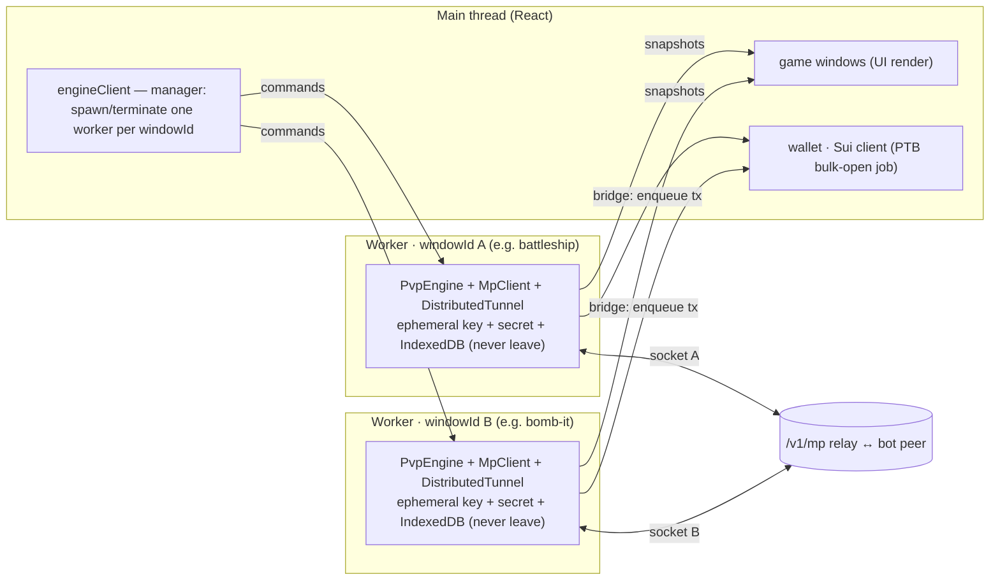
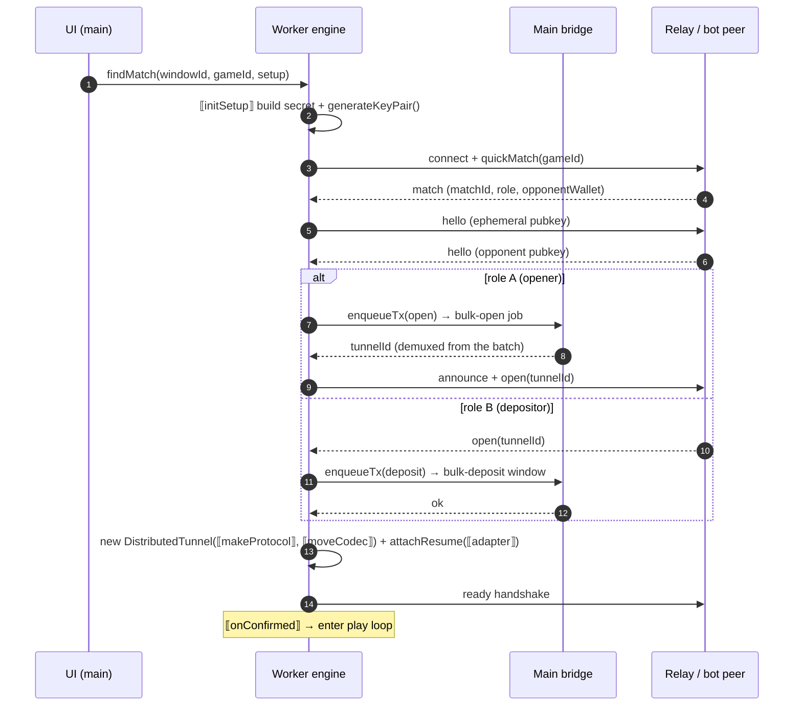
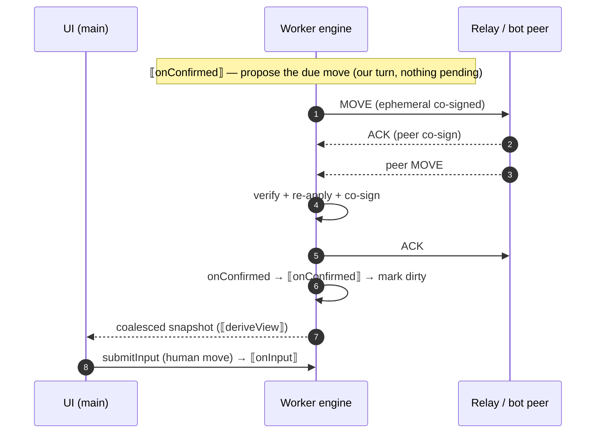
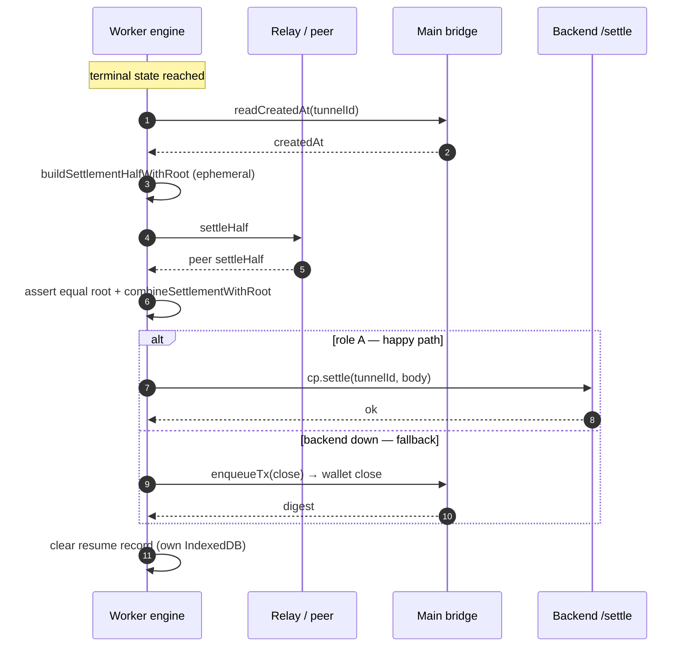

# Front-end tunnel client in a Web Worker — Design

**Status:** Draft (design). The browser-side counterpart to the server-side bot fleet
(ADR-0020); reuses the resume protocol (ADR-0016) and the funding/settle contracts
(ADR-0007/0009/0013/0014) unchanged, and keeps the backend off the per-move path (ADR-0002).
Verified against the repo (the shipped engine draft lives on `feat/ui-worker-engine`:
`engine/{pvpEngine,engineApi}.ts`, `engine/specs/*`, `engine/publicStateSpec.ts`).

**Goal:** Run a real user's per-match tunnel client — the WebSocket relay, the
`DistributedTunnel` state machine, ephemeral co-signing, and any hidden-info secret — in a
**dedicated Web Worker per game window**, off the React main thread, through **one generic
engine** that serves the **public-state game family + battleship (hidden-info)** via a
per-game spec. The main thread renders and owns the wallet + Sui client; it reaches the
worker through three narrow channels.

**In scope (today):** the 4 games the shipped `PVP_SPECS` registers — **bomb-it,
chicken-cross, world-canvas, battleship**. **Out of scope (deferred, §13):** poker,
blackjack, tic-tac-toe/caro — bespoke ~1000-line session hooks not yet on this skeleton.

**Out of scope:** the server-side bot host + its `worker_threads` scaling (its own doc);
the on-chain settlement contract, the relay, and the wire format (unchanged); a core-sized
worker pool and SharedWorker cross-tab sharing (deferred scaling options, §2.1 / §11).

---

## 1. Background

With self-play retired (ADR-0020), a user's browser drives one seat of a live tunnel
against our bot over the `/v1/mp` relay. Today that client runs on the **React main
thread**. Two of the in-scope games are already built on a shared generic engine, the third
shape (battleship) on a near-identical bespoke hook:

- `frontend/src/pvp/pvpMatchHook.ts` — generic `createPvpMatchHook` for public-state games
  (bomb-it, chicken-cross, world-canvas), JSON moves, identity codec, `randomMove` bot.
- `frontend/src/games/battleship/useBattleshipPvp.ts` — hidden-info, binary move codec +
  commit-reveal secret.

The public-state and battleship sessions share one skeleton (`makeInbox`, `findMatch`,
`activateSession`, `settle`, `resume`, the out-of-React `Map<windowId, session>`, the
`useSyncExternalStore` surface). **Three further games — poker, blackjack, ttt/caro — are
separate ~1000-line bespoke hooks not on this skeleton** and are deferred (§13). The shipped
`PVP_SPECS` registers only the 4 in-scope games (`engine/specs/registry.ts`).

**The problem.** The per-move loop is a persistent WebSocket whose `onmessage` fires
continuously plus per-move ed25519 sign/verify. On the main thread it competes with React
commits under the arena's render load (many `TpsChart` canvases, OverviewFloor tiles,
concurrent matches), starving the socket → late ACKs, missed keepalives, avoidable
reconnects. The transport + engine never touch the DOM (no `window`/DOM in `mpClient.ts` /
`distributedTunnel.ts`); only the dapp-kit wallet and Sui client are main-bound, clustered at
open/fund and settle — never per move.

**Two real worker-portability caveats** (verified):
- `localStorage` and `window` unload listeners are **absent in workers** — the resume
  *logic* (`resumeSession.ts`, `mpClient.ts`, `distributedTunnel.ts`) is portable, but its
  *persistence* (`resume.ts`) uses `localStorage` + `pagehide`. This is the forcing function
  for the persistence design (§5/§6), not "we need IndexedDB" abstractly.
- `resolveMpWsUrl` reads `location.origin` (`mpClient.ts:116-120`). In a worker
  `self.location` is the **worker-script URL**, not the page origin — resolve the WS URL on
  main and pass it via `init(config)`, don't rely on worker `location`.

---

## 2. Architecture

Split along the DOM line: everything DOM-free moves to a dedicated Web Worker per game
window; everything React/DOM-bound stays on main; they communicate over three narrow
channels.



- **One worker per game window.** A worker owns exactly that window's match: its `MpClient`
  (+ socket), `DistributedTunnel`, ephemeral co-signing, hidden-info secret, transcript, its
  own IndexedDB persistence, and the session skeleton (`makeInbox`, `activateSession`,
  `resume`). It is the **single source of truth for that window's match**, and runs the
  happy-path settle (`cp.settle` is a `fetch`).
- **Main thread** owns: rendering from coalesced snapshots, the dapp-kit wallet, the Sui
  client, and `window` lifecycle (`pagehide`/`visibility`). `engineClient` is the
  **manager**: it spawns a worker when a game window opens and `terminate()`s it when the
  window closes, and runs the PTB bulk-open job (§4.1).
- Workers are **independent — they share no data** (each match is self-contained: its own
  tunnel, key, secret, state). So there is no cross-worker coordination, no shared memory,
  no frame router. The model's cost is **memory, not coordination** (§2.1).

### 2.1 Worker model & scaling

- **Cardinality: 1 game window ↔ 1 worker ↔ 1 socket ↔ 1 match** (1:1:1:1). `engineClient`
  spawns/terminates by `windowId`. (`MpClient` *can* multiplex many tunnels on one socket;
  here each window uses its own worker+socket because matches are independent and isolation
  is worth more than socket sharing at this scale.)
- **Why per-window, not one shared worker or a pool:** matches share no data, so per-window
  gives clean isolation (one game hanging/crashing can't touch another) with zero
  coordination code.
- **CPU is not the constraint at human pace.** Each worker is mostly **blocked on the
  network** → an idle thread the OS doesn't schedule → ≈0 CPU. Thread oversubscription only
  bites when many run **CPU-bound simultaneously** (sustained high-TPS), which human play is
  not.
- **The real cost is memory.** Each worker is its own V8 isolate that instantiates the engine
  bundle (~a few MB each). Manage it: **lazy-spawn** on window open; **`terminate()` on
  close** (via `registerWindowDisposer`); **pause / tear down offscreen** windows
  (IntersectionObserver, as `TpsChart` does); all workers load the **same script URL** so the
  browser reuses compiled bytecode.
- **Concurrency cap — device-tiered (4 tiers).** Cap concurrent *live* worker-windows by
  device capability so per-window memory (bullet above) stays within budget; offscreen/paused
  windows are torn down and don't count. Tier by `navigator.hardwareConcurrency` (and
  `navigator.deviceMemory` when present — take the **lower** tier the two imply):
    - **Low** (≤2 cores / ≤2 GB) → **4** live windows
    - **Mid** (≤4 cores / 4 GB) → **8**
    - **High** (≤8 cores / 8 GB) → **16**
    - **Max** (≥12 cores / ≥8 GB) → **20** (the realistic ceiling)

  `deviceMemory` is coarse (caps at 8) and absent in Firefox/Safari → default to **Mid** when
  it's missing and tier off cores. Past the cap, new windows **queue** or fall back to an
  **SSE-spectate tile** (escape hatch below) instead of spawning a worker.
- **Sockets:** one per worker → ≈ number of *live* windows (bounded by the cap above). Far
  under the browser cap (~255 Chrome / ~200 Firefox per host; shared process-wide, worker
  sockets count against it).
- **Escape hatch (only for all-games high-TPS auto-play):** drive a pure-spectate floor from
  **server SSE** (no per-tile engine/socket), or switch to a **worker pool sized to cores**.
  The `engineClient` manager boundary keeps either swap localized.

---

## 3. The generic engine + per-game spec

The engine is the shared skeleton, game-agnostic. Each game supplies a `GameSessionSpec`,
registered by `gameId` in `PVP_SPECS` the worker imports (closures can't cross the worker
boundary, so specs are imported and *addressed* by canonical game id, ADR-0022).

The shipped controller contract (de-facto, `engine/engineApi.ts` on `feat/ui-worker-engine`)
uses **discrete hooks**, not a single `onTick`:

```ts
interface GameSessionSpec<State, Move, Setup, Input, View> {
  game: GameId;
  stake: bigint;                         // in-scope games only; see §13 for stake strategies
  stepMs?: number;                       // optional idle pacing (bot watchability)
  makeProtocol(): Protocol<State, Move>; // nullary today; §13 needs makeProtocol(setup)
  moveCodec?: MoveCodec<Move>;           // REQUIRED iff protocol.movesCarrySecrets (tunnel enforces)
  outcome(state: State): Outcome;        // replaces `State extends { winner }` — ttt's winner is nested
  createMatch(io: MatchIo<State, Move>): MatchController<Setup, Input, View>;
}

interface MatchController<Setup, Input, View> {
  initSetup(setup: Setup): void;         // build secret from UI setup (battleship), else no-op
  onConfirmed(): void;                   // a co-signed update landed → propose the due move
  onInput(input: Input): void;           // a human input (fire/intent) → propose if due
  setAuto(on: boolean): void;            // autopilot toggle
  deriveView(displayState: State): View; // render-ready, plain — the only thing crossing to UI
  resumeAdapter(): ResumeAdapter<State, Move>;
  dispose(): void;
}
```

- The three move-driver hooks (`onConfirmed`/`onInput`/`setAuto`) are how the shipped engine
  unifies battleship's `proposeDue` and the public-state `maybePropose`/`proposePlan`: each
  means "on this event, propose the due move iff it's my turn and nothing is pending." (Note:
  poker/blackjack run **3-lane drivers** — plumbing + player + bet — which a single
  `onConfirmed` does not capture; §13.)
- **`onSettled` is intentionally absent.** Telemetry is the main-thread `useTelemetry` writer
  the worker can't reach, and it is **incremental** (per-hand/round/game). It must be wired
  **main-side off the snapshot stream** (§5 telemetry), not via a worker callback. (The draft
  `battleshipSpec.ts` currently drops the "My Activity" settle row the legacy hook emits —
  restore it main-side.)

### Variation points (the spec must express all of these)

| Variation | in-scope shape | spec field |
| --- | --- | --- |
| protocol / codec | identity vs `battleshipMoveCodec` (strips secret) | `makeProtocol` / `moveCodec?` |
| secret | none vs `FleetSecret` | `initSetup` |
| move driver | `maybePropose` vs `proposeDue` | `onConfirmed`/`onInput`/`setAuto` |
| auto / bot | `randomMove` vs `pickShot` | controller-internal |
| input / setup | `setIntent` / `findMatch()` vs `fire(cell)` / `findMatch(placements)` | `onInput` / `Setup` |
| view (+ session-local) | plain vs board+placements+lastShots | `deriveView` |
| outcome | flat `winner` vs nested/no-winner | `outcome(state)` |
| resume adapter | per game | `resumeAdapter` |
| stake / pacing / telemetry | fixed vs §13 | `stake` / `stepMs` / main-side |

Everything else (matchmaking, funding, tunnel construction, the ACK loop, settle, resume
transport, snapshot emission) is **engine**, not spec.

### 3.1 Plug-in API — a game plugs in with (ideally) only a spec

The shipped helper `makePublicStateSpec({...})` (`engine/publicStateSpec.ts`) takes the
**same 8 fields** the legacy `createPvpMatchHook` takes (`game, stake, stepMs, makeProtocol,
deriveView, idleIntent, intentToMove, readIntent, makeResumeAdapter`); `bombItSpec.ts` /
`chickenCrossSpec.ts` are ~30 declarative lines each. To make authoring truly **spec-only**:

- **`useGameMatch(windowId, gameId)`** must internally (a) call `useConfigureEngine()`
  (today a per-hook foot-gun — forget it and `findMatch` throws "engine bridge not
  configured"), (b) fire `engineClient.resume(windowId, gameId)` once on mount (today **never
  called on the worker path** — a mid-match reload won't reattach under the flag), and (c)
  wire a `visibilitychange`/`pagehide` effect → `engineClient.setVisibility` (today **never
  forwarded**). The hook currently takes only `windowId` and does none of these.
- **`makeBatchedPublicStateSpec({ ...fields, stampSeq, trimConfirmed, maxBatch })`** + a new
  `MatchController.reconcile(view)` hook so world-canvas's paint buffer / per-seat `seq`
  stamping / confirmed-seq trim move **into the worker** (today ~150 lines in
  `usePvpWorldCanvas.ts:141-192`, still on main even under the flag). This is what makes
  "spec-only for all in-scope games" actually true.
- **`makeCommitRevealSpec({...})`** for hidden-info turn games, encapsulating the
  "fire-vs-propose same-tick" ordering invariant once (today battleship hand-rolls a full
  `MatchController`).
- **`defineGame(spec)`** auto-registration (import side-effect) so adding a game is one spec
  file, not "write spec + edit `registry.ts`".

Target authoring surface: a public-state game = one `<game>Spec.ts`
(`makePublicStateSpec(...)` + `defineGame(...)`) + a 3-line `usePvp<Game>` calling
`useGameMatch(windowId, gameId)`.

---

## 4. The three channels

1. **Commands — main → worker (Comlink RPC).** `findMatch(windowId, gameId, setup?)`,
   `submitInput(windowId, input)`, `setAuto(windowId, on)`, `resume(windowId, gameId)`,
   `reset(windowId)`, `setVisibility(visible)`, `init(config)` (incl. the resolved WS URL),
   `attachBridge(bridge)`, `shutdown()`. (§13 adds a generic control channel for
   `requestSettle`/`leave`/`setStake`/`fund`/`requeue`.)
2. **Snapshot stream — worker → main (raw `MessagePort`).** A coalesced `MatchSnapshot` per
   dirty match — `{ status, role, auto, stake, view, outcome, opponentWallet, tunnelId,
   connStatus, error }`. The `view` is `deriveView`'s output; **`tunnelId` and `connStatus`
   must be carried** (today world-canvas fabricates a synthetic id). All fields plain.
3. **Bridge — worker → main (Comlink.proxy callbacks).** Chain writes only; **all
   `@mysten/sui` tx-building, signing, and the Sui client stay on main**. Workers do not sign
   per match — they **enqueue tx intents** (`enqueueTx(intent) → Promise<result>`, for
   open/deposit/close) plus the read `readCreatedAt(tunnelId)`; the main-thread **bulk-open
   job** (§4.1) executes them. Backend HTTP (`cp.settle`, register/heartbeat) is `fetch` in
   the worker, not the bridge. **No storage bridge** — each worker owns its persistence in
   **IndexedDB** (§6).

Everything crossing is structured-cloneable (`bigint`, `Uint8Array`, plain objects);
`Protocol`/codec/spec are closures and are imported in the worker, never sent.

### 4.1 On-chain writes: time-windowed bulk-open job (Enoki rate-limit batching)

Workers never sign; they enqueue open intents through the bridge. A main-thread job fires on a
**fixed ~5 s tick** (`BULK_OPEN_WINDOW_MS ≈ 5000` — not a sub-second debounce; independent game
opens arrive seconds apart), drains the per-sender queue, and composes the accumulated intents
into one Programmable Transaction Block. A lone intent that has waited a short minimum with
nothing else arriving flushes early, so a single match doesn't pay the full 5 s to start.

- **Motivation — Enoki rate limits, not popups.** For zkLogin users, sponsored open is
  **already popup-free** (Enoki signs the sponsor-returned bytes programmatically); only
  external browser wallets prompt. Each separate open is one `/v1/sponsor` + one
  `/v1/sponsor/execute` Enoki pair; the **backend adds no rate limit of its own**, so Enoki's
  project ceiling is the live limit. **One batch PTB = exactly one sponsor+execute pair**,
  validated once against one allowlist set — this is what keeps show-all under the ceiling.
- **Shard by sender (one sender per PTB).** A Sui tx has a single `sender`, and the sponsor
  guard forces every stake withdrawal to `WithdrawFrom::Sender` (cross-player batching is
  rejected, and unit-tested). So the job **shards by sender** and batches that sender's many
  game-window opens — exactly the ADR-0013 reload scenario; for seat-A opens that's the
  single local user. Use **one summed `redeem_funds` withdrawal** for the batch (SDK
  precedent: `buildOpenAndFundMany` / `openAndFundMany`), not N withdrawals.
- **What is batchable.** (1) **Seat-A opens — YES** (the job's core). (2) **Seat-B deposits —
  YES, but a separate downstream window** gated on the opens having committed (B needs the
  shared tunnel id). (3) **Open→its-own-deposit — NO** (cross-tx dependency). (4)
  **Cross-player opens — NO** (one sender per PTB). (5) **Close — NOT on this path:** the
  happy-path close is backend HTTP `cp.settle` (settler-sponsored), off the Enoki
  `/v1/sponsor` budget; only the rare wallet fallback `closeCooperativeWithRoot` is a
  sponsored tx, and batching a lone fallback-close with opens has no rate-limit benefit.
- **On-chain constraints the job must respect.**
  - **One sender per PTB** (shard by sender).
  - **Settler-fallback gas cap ≈ 0.1 SUI** (`SPONSOR_GAS_BUDGET`) is the whole-PTB budget;
    `create_and_share` is shared-object-heavy, so size batches to fit or the batch only lands
    on Enoki (own gas) and silently fails the settler fallback.
  - **Sui PTB ceilings** (command/input/128 KB) — flush in modest chunks.
  - **Checkpoint-lag funding:** let `ensureMtpsAddressBalance` settle the deposit before
    opening, or the "invalid withdraw reservation" reject applies.
- **Atomicity + per-offender fallback.** A PTB is all-or-nothing; one aborting spec fails all
  N. Pre-validate intents and, **only on PRE-commit failure**, retry offenders individually.
  **Never retry after commit:** on a `BatchCommittedError` (commit succeeded but post-commit
  correlation failed) a retry double-opens and double-consumes stake — surface the error, do
  not retry.
- **New code:** a PvP many-opens builder (`create` + `deposit_party_a` + `public_share_object`
  ×N) is **new frontend code** (only the self-play `create_and_fund` many-builder exists
  today). **No backend allowlist change** is needed — these calls are already allowlisted.

---

## 5. Data flow (engine drives; spec hooks marked …)

**Setup — worker-orchestrated, role-asymmetric funding** (… = spec hook):



> **Funding is not uniform across games.** The engine assumes role A opens via the staked
> path (`pvpEngine.ts`), but the deferred games break this: blackjack's dealer is **role B and
> opens** with a `penalty`, and ttt opens via a **zkLogin custom wallet, sender-pays, not
> dapp-kit**. The bridge's coarse ops can't express B-opens, penalty params, or non-dapp-kit
> signing — a **pluggable opener/funding strategy** is required before those games are in
> scope (§13).

**Play loop — fully in the worker:**



**Settle — backend HTTP happy path, wallet only on fallback:**



**Resume / persistence (worker-owned IndexedDB).** Resume records (the ephemeral secret,
opponent pubkey, and the spec's serialized game secret) are written by the worker to its own
**IndexedDB** — `localStorage` is unavailable in workers, and keeping these worker-side means
they never transit the main-thread heap or the bridge. Because IndexedDB is **async**, the
worker **persists eagerly on every confirmed update** (the cadence `attachResume` already
uses); a `pagehide` flush is best-effort, not relied on (an async write can't be awaited as
the page tears down). Main owns `pagehide`/`visibility` and signals the worker, but the
durable state is already on disk. Cold-load `resume()` reads IndexedDB **in the worker**,
rebuilds tunnels, hydrates the secret via the spec's adapter, and `mp.connect()`'s handshake
carries the resume frames.

> **Cost of choosing IndexedDB (accepted):** the worker must **re-implement the ~220 lines of
> `resume.ts`** (active-tunnel index, 6h TTL, debounce, bigint codec, secret round-trip) that
> 8 test files prove today, and it **loses the synchronous `pagehide` flush** localStorage
> gives (eager writes mitigate). Eviction: under WebKit ITP both `localStorage` and IndexedDB
> are evictable (7-day-no-interaction + storage-pressure) — the 6h TTL self-bounds records
> well under that window, so switching backends doesn't change eviction materially.
> `navigator.storage.persist()` protects only the IndexedDB bucket and is unwarranted under a
> 6h TTL. The win that justifies the cost: the secret + ephemeral key never enter the main
> heap / `postMessage` (the §9 confinement invariant holds on this path).

**Telemetry / snapshot (wired main-side).** Telemetry is incremental (per-hand poker,
per-round blackjack, per-game + cumulative ttt, throttled "painted N cells" world-canvas) and
the worker can't reach `useTelemetry`. Add a generic **`useMatchTelemetry(snap, gameId)`** on
main that emits rows off the snapshot stream; restore battleship's settle row. Per-hand/round
balance deltas the rows need may not be in `view` — the snapshot or a lifecycle event must
carry them. Likewise, create/deposit/close **tx digests** shown in some UIs are produced by
the bridge on **main** (not derivable from tunnel state), so `deriveView` can't emit them —
surface them via the bridge result, not the snapshot.

---

## 6. Secrets (hidden-info games)

Handled by the same engine; the secret is a spec concern and is **confined to the worker**:
built there from UI setup (`initSetup`), it **never crosses the wire** — `DistributedTunnel`
throws unless a `movesCarrySecrets` protocol supplies a stripping `moveCodec` — and it
**never crosses to the UI** (the worker computes `deriveView`, including your own board, and
ships only the plain `View`). It persists for resume in the **worker's own IndexedDB**.

On the chosen IndexedDB path the secret and ephemeral key **genuinely never enter the main
heap, `postMessage`, or `localStorage`** — that confinement is the reason IndexedDB was chosen
over a localStorage storage-bridge (which would transit the record through main on every
write). **Honest scope:** a Web Worker is still *not* a security sandbox against same-origin
XSS — IndexedDB is same-origin and readable from the main thread / devtools, and an attacker
with script on the page can reach it. This is **exposure reduction** (no accidental leakage
via console/log/main-heap), not a hard boundary; real key protection needs a separate
origin/iframe or hardware (out of scope).

---

## 7. Snapshot coalescing

The worker holds authoritative state and **only posts on actual change**: a
`dirty: Set<windowId>` coalesced by one ~16 ms `setTimeout` flush (no `requestAnimationFrame`
in workers). An unchanged tick emits nothing — a human-paced board game posts ~once per move,
not 60×/s, keeping structured-clone churn and GC pressure low. Main forwards
`visibilitychange` so a hidden tab pauses flushes.

- **Background throttling — mostly fine, one real exception.** Browsers clamp worker
  `setTimeout` to ≥1 s in a backgrounded tab. The per-move loop is **network-event-driven**
  (incoming WS frames wake the worker and aren't timer-throttled) and WS keepalive is
  protocol-level pong, so clamping only **stalls the flush/idle-pacing cadence**, not
  correctness; a fully torn-down/frozen tab is covered by resume. **Exception:**
  timeout-driven *gameplay* clocks — poker's 10s per-turn countdown that auto-checks/folds on
  expiry — must be anchored to **peer/wall-clock time, not a background-throttleable worker
  `setTimeout`**, or a hidden tab will auto-fold the player. Snapshot flush and bot pacing may
  stall harmlessly; the turn clock must not (§13).
- **Large / high-rate views (e.g. world-canvas):** if a view is big and changes fast, encode
  it into a binary `ArrayBuffer` and **transfer** it (zero-copy) instead of structured-cloning
  a deep object each flush. For the typical small board view, plain clone is cheaper than the
  encode — apply transferables per game only where the view is genuinely large.

---

## 8. React integration

```ts
function useGameMatch(windowId: string, gameId: GameId): MatchSnapshot {
  // also: useConfigureEngine(); resume(windowId, gameId) on mount; setVisibility wiring (§3.1)
  return useSyncExternalStore(
    (cb) => engineClient.subscribe(windowId, cb),
    () => engineClient.getSnapshot(windowId),   // stable ref until a new snapshot arrives
  );
}
```

`engineClient` (main) spawns the worker, wires the bridge + snapshot port, keeps the
`Map<windowId, MatchSnapshot>` store, and runs the bulk-open job. **"Wrappers shrink to a
domain rename" holds only for simple public-state games** (bomb-it, chicken-cross). Caveats:
world-canvas keeps ~150–220 lines of paint-buffer / per-seat-seq / confirmed-seq trim in the
React wrapper (`usePvpWorldCanvas.ts:141-192`) — still on main even under `?engine=worker`
until `makeBatchedPublicStateSpec` + `reconcile` move it into the worker (§3.1); battleship
hand-rolls a full `MatchController`. Ship behind a `?engine=worker` flag for A/B against the
current main-thread path. **Cross-cutting wiring still missing on the worker path:** resume is
never triggered, visibility never forwarded, and `useConfigureEngine` is a foot-gun (§3.1) —
fold all three into `useGameMatch`.

---

## 9. Invariants

- The backend is never on the per-move path (ADR-0002): per move is worker↔relay↔peer only.
- The real wallet and Sui client never enter the worker; the ephemeral key and game secret
  never leave it.
- Per-move signing uses the ephemeral key; the real wallet signs only open/fund and the settle
  fallback — and only via the main-thread bulk-open job (§4.1), never in a worker
  (ADR-0007/0009/0013/0014 contracts unchanged).
- On the chosen IndexedDB path, secrets + the ephemeral key never enter the main-thread heap,
  `postMessage`, or `localStorage` (§6).
- The engine signals events; the spec owns move ordering — preserve battleship's guard against
  firing a shot the same tick a commit/reveal is proposed.

---

## 10. Module layout & migration

```
frontend/src/engine/
  engine.worker.ts · pvpEngine.ts · engineApi.ts · engineClient.ts
  publicStateSpec.ts · specs/registry.ts (PVP_SPECS) · persist/idb.ts (worker IndexedDB)
  chain/bulkOpenJob.ts (main: time-windowed PTB job) · onchain many-opens builder (new)
  react/{EngineProvider.tsx,useGameMatch.ts}
games/<game>/<game>Spec.ts        # each game's GameSessionSpec
```

Migration is **de-duplication, not a rewrite** for the in-scope shapes: extract the shared
skeleton from `pvpMatchHook.ts` + `useBattleshipPvp.ts` into `pvpEngine.ts` (largely done on
`feat/ui-worker-engine`), lift each game's variation points into a `GameSessionSpec`, host the
engine in the worker. The deferred games (§13) need spec extensions first.

---

## 11. Risks & open questions

- **Scope:** only 4/7 games fit the current spec; poker/blackjack/ttt-caro need the §13
  extensions before they can move to the worker.
- **Funding non-uniformity:** B-opens, penalty stakes, and zkLogin sender-pays signing aren't
  expressible by the two coarse bridge ops — pluggable opener/funding strategy needed (§13).
- **Bulk-open atomicity:** one aborting command fails the whole PTB — pre-validate + retry
  offenders **only pre-commit**; never retry a `BatchCommittedError` (double-open) (§4.1).
- **IndexedDB persistence (accepted cost):** must re-implement `resume.ts` logic and loses the
  synchronous unload flush — rely on eager writes; `pagehide` is best-effort (§5).
- **Background throttle exception:** timeout-driven gameplay clocks (poker turn timer) must be
  wall-clock/peer-anchored, not worker `setTimeout` (§7).
- **Cross-cutting unwired:** resume/visibility/config not yet wired on the worker path; fold
  into `useGameMatch` (§3.1/§8).
- **GC / clone pressure** from snapshots — emit only on change, transfer (not clone) large
  binary views (§7).
- **Per-game-worker memory** at many open games — lazy-spawn + `terminate()` on close +
  pause-offscreen (§2.1); a recycled pool amortizes spawn *churn* but not *peak* memory.
- **Perf gate (do this first):** profile the main thread under heavy UI to confirm the engine
  is the jank source (vs chart rendering) before relying on the worker — then gate default-on
  on long-task / dropped-frame / WS-ACK-latency checks.
- **Debugging spans two threads;** the bridge + snapshot protocol must surface clear errors.
- **SharedWorker** is a deferred cross-tab option; the `engineClient` boundary keeps it local.

---

## 12. Follow-ups

- Finish `pvpEngine` + `GameSessionSpec` + `PVP_SPECS` for the 4 in-scope games; fold
  resume/visibility/config wiring into `useGameMatch`.
- Re-implement resume/secret persistence as **worker-owned IndexedDB** (eager writes;
  port `resume.ts`'s index/TTL/debounce/bigint codec).
- Build the **bulk-open job** (main, ~5 s tick, per-sender shard) + the PvP many-opens
  on-chain builder; per-offender **pre-commit-only** fallback; `BatchCommittedError` =
  surface, never retry.
- Implement the **device-tiered window cap** (4 tiers off `hardwareConcurrency`/`deviceMemory`)
  with queue / SSE-spectate overflow.
- Add the generic helpers: `defineGame`, `makeBatchedPublicStateSpec` + `reconcile`,
  `makeCommitRevealSpec`; `useMatchTelemetry` (main-side); carry `tunnelId`/`connStatus` in
  the snapshot.
- Profile the main thread under heavy UI (perf gate); then `?engine=worker` flag → flip
  default once it passes.
- Spec extensions for the deferred games (§13).

---

## 13. Extensions required for the bespoke games (poker, blackjack, ttt/caro, world-canvas)

The §3 spec covers 4/7 games. To cover the rest, add:

- **`makeProtocol(setup)`** (parameterized, not nullary): caro needs board size + max-games,
  ttt `(MAX_GAMES, STAKE)`, poker a hand cap, blackjack a `penalty`.
- **`matchmakingKey(setup)`** deriver: ttt's queue key is composite
  (`tictactoe:caro:${boardSize}`) but the engine hardcodes `mp.quickMatch(gameId)` — one
  `gameId` must map to many queue keys.
- **Stake / funding strategy** (replaces `stake: bigint`): user-chosen + **asymmetric**
  `stakeA≠stakeB` + `penalty` (blackjack), **multi-tunnel recycle** on bust (poker opens a
  fresh tunnel and keeps playing), and **opener-role + signer** selection (B-opens; zkLogin
  custom-wallet sender-pays vs dapp-kit).
- **Settle-policy hook**: submitter selection (winner-submits ttt; dealer/B-submits
  blackjack; staying-seat poker), leaver/`publishOnly`, on-chain `update_state`
  checkpoint-before-close (blackjack), early-settle at hand boundary, and settle
  retry/requeue (ttt).
- **Generic control-command channel** on the command channel: `requestSettle`, `backOut`,
  `stop`, `leave`, `setStake`, `fund` (faucet), `requeue` — early-settle/leave/rebuy/faucet
  the engine owns and `submitInput` can't express.
- **`outcome(state)`** (already in §3) for nested/no-single-winner states.
- **3-lane drivers** for poker/blackjack (plumbing + player + bet) — a single `onConfirmed`
  doesn't capture them.
- **Wall-clock turn timer** (poker 10s auto-fold) anchored to peer/wall-clock, not worker
  `setTimeout` (§7).
- **World-canvas session-local state**: `reconcile(view)` + `makeBatchedPublicStateSpec`
  (§3.1) lift the paint buffer/seq logic into the worker.
- **Handshake/ephemeral reconciliation**: blackjack/ttt use `opened` (not `open`), exchange an
  extra `stake` message, carry `stop`/`closed` peer messages, and derive a **persisted**
  per-match ephemeral (`getOrCreateEphemeral(matchId)`) — vs the engine generating a fresh
  keypair each `findMatch`, a resume-correctness mismatch to fix.
