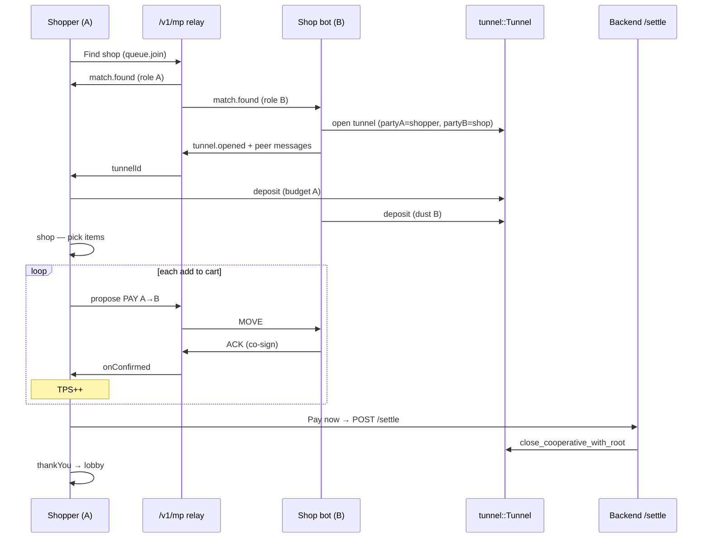
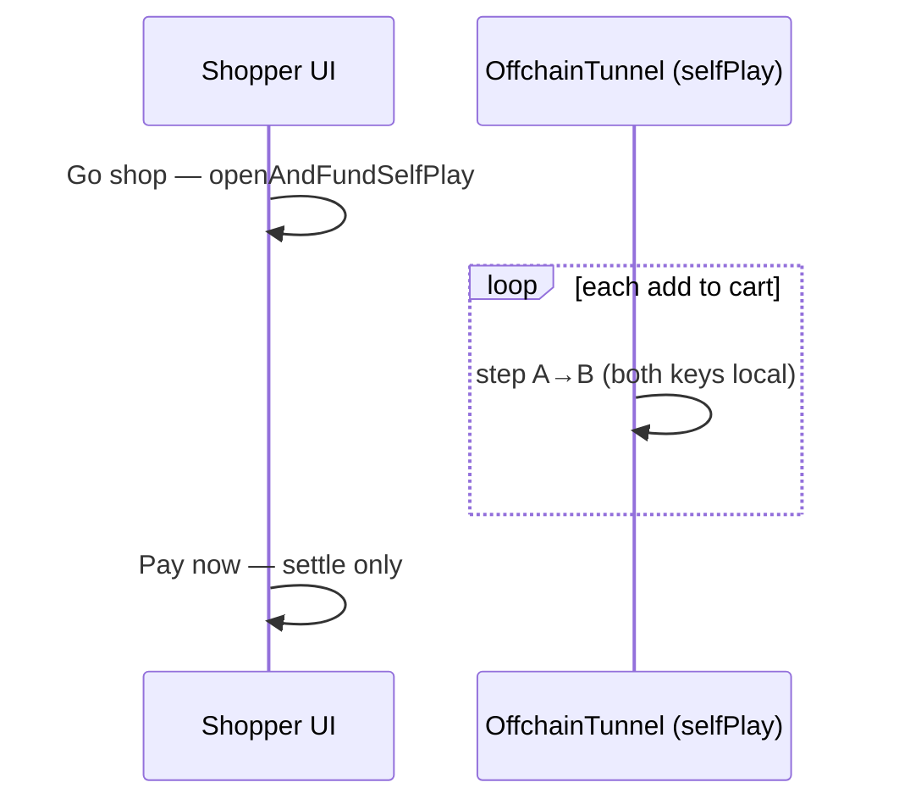
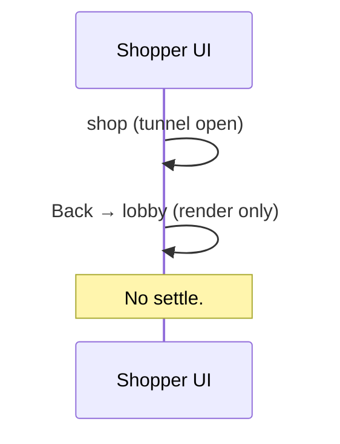

# Regular Payments — Tunnel Mart (VinMart-style grocery checkout)

> **Status:** Approved (design) — **pivot in progress** (bot + WS migration pending server WIP)  
> **Date:** 2026-06-27  
> **Last updated:** 2026-06-30
> **Scope:** **Regular Payments** — a consumer checkout app in the arena payment workspace.  
> **Package:** `frontend/src/games/regularPayments/`  
> **Register id:** `regular-payments` (retire `micro-payments`)  
> **Does NOT cover:** Agent micropayments (app #2), agent allowance / subscriptions (app #3).

**Coding patterns (styling, props, layout):** [2026-06-28-coding-patterns.md](./2026-06-28-coding-patterns.md)

---

## 0. Design pivot (2026-06-29)

Three decisions supersede parts of the original 2026-06-26 draft. **Do not implement from the
retired sections** (marked below).

| Topic | Original draft | **Current target** |
|-------|----------------|-------------------|
| Checkout payment | Micro-payment **stream on Pay now** | **Each cart pick = off-chain co-signed step**; Pay now **settles only** |
| Engine | `OffchainTunnel.selfPlay` (both keys in browser) | **`DistributedTunnel` + `/v1/mp` relay**; user = seat A, **shop bot = seat B** |
| Lobby CTA | **Go shop** (user opens tunnel) | **Find shop** (matchmaking → bot joins WS) |
| TPS peak | During Pay now stream | During **shopping** (item picks; auto mode batches steps) |
| Who opens tunnel | User wallet at Go shop (self-play) | **Shop bot (seat B) opens** — *provisional; confirm when bot WIP lands* |
| UI / styling | — | **Walrus Memory design system** — `frontend/src/designSystem/`, shadcn/ui, `/design-system` |

**Interim shipped code (today):** self-play grocery shop on `feat/regular-payments-grocery` —
useful for UI/catalog/TPS experiments; **not** the long-term architecture.

**Migration gate:** Wait for teammate **bot + WS feature** (matchmaking, relay messages, open/fund
handshake) to land before frontend FIND SHOP migration. Final wire sequence is owned by that WIP,
not copied wholesale from another game.

---

## 1. Problem & goals

The arena needs a **payment-first showcase** that reads as everyday commerce (grocery / GoPay-style
checkout), not NFT vending or arcade games. Regular Payments demonstrates:

- **Deposit-first wallet** — shopper locks a budget in a bilateral tunnel.
- **Catalog shopping** — pick items by category; each pick moves value A→B off-chain.
- **High off-chain throughput** — each verified co-signed tunnel step = 1 action (TPS).
- **Minimal on-chain surface** — open + fund + settle only; no per-pick chain txs.

### Goals

| Goal | Detail |
|------|--------|
| Product truth | VinMart / GoPay: connect wallet → find shop → pick items → pay → receipt |
| TPS metering | 1 verified `tunnel.step` / `onConfirmed` = 1 action (heartbeat contract, ADR-0002) |
| Arena consistency | Walrus Memory design system (`frontend/src/designSystem/`, shadcn/ui, `/design-system` showcase) |
| Clean codebase | `regularPayments` package; **do not extend** `microrPayments` (NFT, machine grid) |
| Honest counterparty | Real two-party tunnel vs shop bot over relay (ADR-0020 direction) |

### Non-goals

- NFT mint or gacha rewards
- New Move module deploy — use core `tunnel::Tunnel<T>`
- Subscription / allowance flows (separate apps)
- Merging agent micropayments / allowance into this UI

---

## 2. Core concept

**Tunnel Mart** is a floating arena widget (`workspace: "payment"`, `catalog: true`).

```
Party A  =  Shopper (user wallet + per-match ephemeral key)
Party B  =  Store POS (shop bot — managed key on server fleet)
```

Each shopping trip (target):

1. **Lobby** — **Find shop** → `queue.join("regular-payments")` on `/v1/mp` → paired with shop bot.
2. **Fund** — bot opens tunnel (target); shopper deposits **10 MTPS** budget; bot deposits activation dust.
3. **Shop** — each **add to cart** = `payments.v1` step `{ from: "A", amount: catalogPrice }` over relay;
   bot co-signs if valid. **Remove** = B→A refund (bot cooperates — detail TBD in bot WIP).
4. **Pay now** — **settle only** (transcript already contains all payment steps).
5. **Thank you** — receipt; return to lobby.

**Pay now does not run a micro-payment stream.** That flow is retired.

### Catalog

Product list (`PRODUCTS` in `utils/catalog.ts`) is maintained by the team as the shared price
truth for FE + shop bot. Moves must match catalog prices (`verifyMove` on FE; mirror on bot).

---

## 3. Architecture

### 3.1 Layers (target)

| Layer | Responsibility | Target |
|-------|----------------|--------|
| **UI** | Lobby / Shop / Thank you | `components/Payments*` |
| **Hook** | Session lifecycle, screens, telemetry | `useRegularPaymentsPvpSession` (new; replaces self-play hook) |
| **Session core** | Cart math, `verifyMove`, pure helpers | `utils/sessionCore.ts` (+ tests) |
| **Protocol** | Off-chain transitions | `sui-tunnel-ts` **`payments.v1`** |
| **Engine** | Co-signed steps | `DistributedTunnel` + `MpClient` relay transport |
| **Counterparty** | Seat B co-sign | Shop bot (`fleet-serve` / agent kit — WIP) |
| **Open / fund** | On-chain | Bot opens (target) → shopper deposits budget → bot deposits dust |
| **Settle** | Close + transcript | `POST /settle` + `close_cooperative_with_root` fallback |
| **Telemetry** | TPS | `registerSession` + `sendHeartbeat` (`game: "regular-payments"`) |

### 3.2 Interim (self-play — retire after bot migration)

| Layer | Today |
|-------|-------|
| Engine | `OffchainTunnel.selfPlay` |
| Open | `openAndFundSelfPlay` (one wallet, both seats) |
| Cart step | `tunnel.step` on add/remove in browser |

### 3.3 On-chain vs off-chain (target)

| Phase | Chain | Who | Count per trip |
|-------|-------|-----|----------------|
| Find shop | — | User + matchmaking | 0 |
| Open tunnel | On-chain | **Shop bot (B)** — *pending WIP confirm* | 1 create tx |
| Fund shopper | On-chain | User wallet (A) | 1 deposit tx |
| Fund shop dust | On-chain | Bot (B) | 1 deposit tx |
| Add to cart | Off-chain | A proposes → relay → B co-signs | 1 step per pick |
| Remove from cart | Off-chain | B proposes refund → A co-signs | 1 step per remove (TBD) |
| Pay now | On-chain | User `/settle` | 1 close tx |

**Move module:** core `sui_tunnel::tunnel` — not `example_payment_channel.move`.

### 3.4 Economics (defaults)

| Field | Value | Notes |
|-------|-------|-------|
| `depositBudget` (party A) | **10 MTPS** | Shopper budget |
| `depositB` (activation dust) | **1** base unit | Shop seat; not shop capital |
| Catalog prices | ~0.01–0.02 MTPS | High step count per full cart |

`TICK_COUNT` / `MICRO_UNIT` / Pay-now stream constants are **retired** for the target flow
(may remain in repo until cleanup).

---

## 4. Screen flow & UI states

### 4.1 Screen machine (target)

```
lobby ──(Find shop, match+open+fund)──► shop ──(Pay now, settle only)──► thankYou ──(3s|Go lobby)──► lobby
  ▲                                    │
  └──────── Back (UI only) ────────────┘
```

| Screen | Purpose |
|--------|---------|
| `lobby` | Intro, **Find shop** (matchmaking + funding) |
| `shop` | Catalog, cart, live budget, TPS during picks |
| `thankYou` | Receipt, **Go lobby**, 3s auto-return |

### 4.2 Lobby (target)

- Title **Tunnel Mart** / Regular Payments
- **Find shop** — disabled until wallet connected
- States: idle → matching → funding → error
- Interim label **Go shop** remains until migration

### 4.3 Shop

**Header (`PaymentsShopHeader`)**

- ← **Back** → lobby (**UI only**; no settle)
- Category chips: Fresh | Snacks | Drinks
- Budget remaining (`font-mono`)
- **TPS** chip — rolling 1s window **while picking items** (not Pay now)

**Body (`PaymentsShopBody`)**

- Product grid; tap → add line + off-chain payment step

**Cart (`PaymentsShopCart`)**

- Item count, total, **Pay now** → settle → thank you
- Progress reflects cart / balance moved during shop (not a pay-stream bar)

**Back behavior (locked):** UI-only → lobby; no settle; cart policy unchanged from interim.

### 4.4 Thank you

- Thank-you copy + optional receipt (items, total, settle digest link)
- **Go lobby** + 3s auto-return
- New trip → new Find shop / fresh tunnel

### 4.5 ~~Pay stream UX~~ (retired)

Pay now no longer runs an off-chain stream. Catalog + cart are locked only while `settling`.

---

## 5. Sequence diagrams

### 5.1 Happy path (target — bot WIP)



*Open/fund message order is **provisional** until bot WIP documents the canonical handshake.*

### 5.2 Interim self-play (retire)



### 5.3 Back without pay



---

## 6. TPS analytics

### 6.1 Unit of work

- **1 action** = 1 verified co-signed step after confirmation
- Heartbeat: throttled `sendHeartbeat` with `actionsDelta`

### 6.2 Registration

```typescript
registerSession({
  userAddress,
  game: "regular-payments",
  tunnels: [{ tunnelId, partyA, partyB }],
});
```

### 6.3 Display

| Surface | Metric |
|---------|--------|
| Shop header chip | Rolling 1s TPS **during shopping** |
| Telemetry panel | Same heartbeat path as other arena apps |

### 6.4 Throughput (target)

- Manual picks: human-paced (low TPS)
- Auto mode: time-budget batch loop (Bomb It autopilot pattern) — **not** `requestAnimationFrame`
- Post-migration: label as **relay + bot** lane, not self-play

### 6.5 Future levers

- Browser Web Worker for tunnel client (see `docs/design/frontend-tunnel-client-worker.md` on remote branch)
- `fleet-serve` shop bots at scale
- Batch UI updates during auto burst

---

## 7. Protocol & session core

### 7.1 Protocol — `payments.v1`

```typescript
// Per cart add (shopper initiates)
{ from: "A", amount: product.priceMtps }

// Per cart remove (shop initiates — bot cooperates)
{ from: "B", amount: line.priceMtps }
```

Invariants:

- `balanceA + balanceB === total` at every step
- Shopper (A) initiates purchase moves; shop (B) co-signs
- Bot rejects moves that fail protocol + catalog rules (relay is opaque)

### 7.2 Session core (pure)

| Function | Role |
|----------|------|
| `addCartLine` / `removeCartLine` | Cart structure |
| `cartTotal(cart)` | Sum line prices |
| `verifyMove(state, move, catalog)` | Catalog price + balance guards |

Co-locate `sessionCore.test.ts`. Retired: `stepPaymentStream`, `ticksForTotal` for Pay-now stream.

---

## 8. Development principles

See **[2026-06-28-coding-patterns.md](./2026-06-28-coding-patterns.md)**.

---

## 9. On-chain API reference

### Open + fund (target)

Owned by **bot WIP**. Expected shape (provisional):

- Bot (B): `buildCreateAndShare` — registers partyA = shopper, partyB = shop
- Shopper (A): `buildDeposit` — `DEPOSIT_BUDGET`
- Bot (B): `buildDeposit` — `DEPOSIT_B_DUST`

House-opens precedent: blackjack PvP (`usePvpBlackjack` — dealer opens). Final contract = bot WIP.

### Open (interim self-play — retire)

```
openAndFundSelfPlay() → tunnel::create_and_fund_with_id<T>()
```

### Settle (unchanged)

```
buildSettlementWithRoot(createdAt, transcript.root(), 0n)
  → POST /settle (label: "regular-payments")
  → fallback: closeCooperativeWithRoot()
```

### Off-chain (target)

```
new PaymentsProtocol()
DistributedTunnel(..., MpClient transport)
tunnel.propose({ from: "A", amount: priceMtps }, ...)
```

---

## 10. Testing

| Layer | File | Proves |
|-------|------|--------|
| Session core | `utils/sessionCore.test.ts` | Cart, `verifyMove` |
| Catalog | shared `PRODUCTS` | Valid prices / categories |
| Hook | integration after bot WIP | Find shop → pick → settle |
| Protocol | SDK `payments.test.ts` | Conservation |
| Bot kit | `agent/games/regularPayments/kit.test.ts` | A proposes; B never initiates purchases |

---

## 11. Implementation phases

| Phase | Deliverable | Status |
|-------|-------------|--------|
| **P0** | Design doc + `regular-payments` registry | Done |
| **P1** | Types, utils, self-play hook skeleton | Done (interim) |
| **P2** | Grocery shop UI (lobby / shop / thank you) | In progress |
| **P3** | Cart pick = off-chain step (interim self-play) | In progress |
| **P4** | Pay now = settle only | In progress |
| **P5** | TPS batch + telemetry during shop | Planned |
| **P6** | **Bot + WS** (server WIP) | **Blocked — teammate** |
| **P7** | FIND SHOP migration (`DistributedTunnel`) | After P6 |
| **P8** | Remove self-play path | After P7 |

---

## 12. Locked decisions

| Question | Decision |
|----------|----------|
| App id | `regular-payments` |
| Replace micro payments | Yes — grocery checkout, no NFT/machine UX |
| When payment steps run | **On each cart pick** (not Pay now stream) |
| Pay now | **Settle only** |
| Protocol | `payments.v1` |
| Target engine | `DistributedTunnel` + relay (not self-play) |
| Lobby CTA (target) | **Find shop** |
| Shopper seat | **A** |
| Shop bot seat | **B** |
| Who opens tunnel (target) | **Shop bot (B)** — confirm with bot WIP |
| Back from shop | UI only → lobby; no settle |
| TPS window | During **shopping** |
| Auto throughput | Time-budget batch + `sleep(0)` — not rAF |
| Migration gate | Wait for bot + WS WIP before FIND SHOP coding |
| Theme / components | Walrus Memory design system — per [coding-patterns doc](./2026-06-28-coding-patterns.md) §3 |
| Thank you | 3s auto-return + Go lobby |

### Retired (2026-06-29)

| Question | Old decision |
|----------|--------------|
| Pay now micro-stream | ~~500 ticks / ~5s stream on Pay now~~ |
| Cart as local-only UI | ~~0 tunnel steps until Pay now~~ |
| v1 engine | ~~`OffchainTunnel.selfPlay` as long-term choice~~ |
| v2 relay | ~~Deferred~~ — now target architecture |

---

## 13. Related docs

- [2026-06-28-coding-patterns.md](./2026-06-28-coding-patterns.md) — FE coding standards (design system §3)
- `frontend/src/designSystem/` — token tables (`tokens.ts`), live gallery (`DesignSystemPage.tsx` at `/design-system`)
- `frontend/src/styles/index.css` — global `--wal-*` tokens and `.wal-*` helper classes
- `docs/guide/frontend-integration.md` — `/v1/mp` relay contract
- `docs/decisions/0020-bot-fleet-topology-shared-core.md` — bot fleet direction
- `docs/design/frontend-tunnel-client-worker.md` — browser worker (remote branch; optional later)
- `sui-tunnel-ts/src/protocol/payments.ts` — protocol reference
- ADR-0010 (MTPS), ADR-0007 (settle), ADR-0013 (address balance stake)

---

## 14. Payment app roadmap (context)

Regular Payments is **app #1** of three planned payment-category apps:

| App | Protocol | Co-sign per charge |
|-----|----------|-------------------|
| **Regular Payments** (this) | `payments.v1` | Yes (shopper + shop bot) |
| Agent micropayments | `example_agent_micropayments` | Yes (M2M) |
| Agent allowance | `example_agent_allowance` | No (pull / cap) |

Do not merge these into one UI.