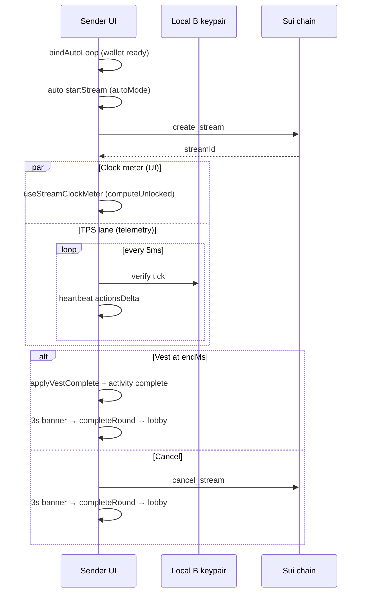
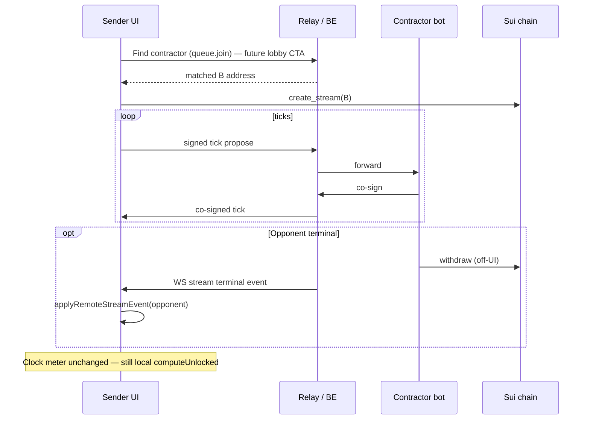

# Streaming Payments — Time-based money stream (salary / subscription / vesting)

> **Status:** Approved — **Variant A self-play showcase shipped**  
> **Date:** 2026-06-30  
> **Last updated:** 2026-07-02
> **Scope:** **Streaming Payments** — a payment-workspace app in the arena.  
> **Package:** `frontend/src/games/streamingPayment/`  
> **Register id:** `streaming-payment`  
> **Does NOT cover:** Regular Payments (tunnel checkout), agent micropayments, agent allowance.

**Coding patterns (styling, props, layout):** [2026-06-30-coding-patterns.md](./2026-06-30-coding-patterns.md)

---

## 0. Design pivot — Variant A

Supersedes the P1 “pure on-chain meter” draft and the early Variant A draft that tied the **UI
meter** to co-signed ticks.

### 0.1 Shipped vs retired vs next phase

| Topic | P1 (retired) | Early Variant A draft | **Shipped (2026-07)** | **P7 BOT-SERVER (WIP)** |
|-------|--------------|----------------------|------------------------|-------------------------|
| Money truth | `PaymentStream` + `Clock` | Same | **Same** | Same |
| **UI meter** | Local `computeUnlocked` only | Tick-verified accrued | **Clock** (`startMs`/`endMs`, `computeUnlocked`) via `useStreamClockMeter` | Same — clock stays local |
| **TPS lane** | None | Tick co-signs → heartbeat | **Same** — ticks telemetry only; **no TPS chip** | Relayed co-signs over WS |
| Counterparty | Hardcoded recipient | Self-play local B | **Self-play** ephemeral B keypair | Matched bot via `/v1/mp` |
| Lobby | Manual Start | Manual Start | **Auto ON** default → auto `startStream`; manual when Auto OFF | **Find contractor** CTA |
| Round end | New stream button | Thank-you screen | **Inline 3s banner** on dashboard → `completeRound()` | Same UX |
| Activity | create / topup / cancel | Tx rows only | + **`complete`** (clock vest, object link) | + opponent cancel via ingress API |
| Post-tx reads | Single `fetchStream` | — | **`fetchStreamAfterMutation`** (indexer lag) | Same |

**Migration gate (same pattern as Regular Payments):** ship **self-play showcase** first. When
teammate **BOT-SERVER** lands (matchmaking + relay), migrate counterparty + remote terminal events
— **do not** rewrite clock meter or auto-loop shape.

**Move / smart contract:** **no changes required** for Variant A. Ticks are off-chain
attestations; payout truth remains `create_stream` / `withdraw` / `cancel_stream` / `top_up` on
`streaming_payment`.

---

## 1. Problem & goals

The arena needs a **payment showcase** for continuous, time-based payouts — salary streams,
subscriptions, vesting — with **high effective TPS** during an active stream (off-chain co-sign
lane). Streaming Payments demonstrates:

- **Lock-and-vest escrow** — sender locks a total amount that unlocks linearly over a duration.
- **Recipient pull** — recipient withdraws unlocked funds on-chain (off sender UI in v1).
- **Sender control** — sender can top up or cancel (pro-rata refund).
- **Verified stream lane** — co-signed off-chain ticks for **telemetry/TPS** (not the UI meter).
- **On-chain honesty** — `PaymentStream` + `Clock` remain the financial source of truth.

### Goals

| Goal | Detail |
|------|--------|
| Product truth | Pay someone over time; money unlocks every second; cancel anytime |
| On-chain honesty | Real Move `PaymentStream` + `Clock`; ticks must not exceed chain unlock |
| Effective TPS | 1 verified tick co-sign = 1 action (heartbeat contract, ADR-0002) |
| Arena consistency | Walrus Memory design system — same rules as Regular Payments |
| Self-play first | Local B client until BOT-SERVER — mirror Regular Payments interim |
| Auto showcase | Default **Auto ON** — unattended lobby → stream → terminal → lobby loop |
| Sender-first UX | This window is the **sender's** dashboard; withdrawal is the recipient's action |

### Non-goals

- `tunnel.move` / tunnel `/settle` for this app
- Changing `streaming_payment` Move for tick/TPS (FE + relay only)
- Merging with Regular Payments, agent micropayments, or agent allowance UIs
- Recipient withdraw UI in v1 (recipient wallet or bot fleet)
- Separate **thank-you** screen (inline banner only — unlike Regular Payments full-page receipt)
- **TPS chip** on dashboard (heartbeat remains internal)

---

## 2. Core concept

**Streaming Payment** is a floating arena widget (`workspace: "payment"`, `catalog: true`).

### Parties

```
Party A  =  Sender (connected wallet — creates stream, signs ticks, tops up, cancels)
Party B  =  Contractor recipient (self-play: local keypair; P7: matched bot over relay)
```

**Interim self-play:** B is simulated in-browser (`createParticipant("streaming-receiver")` per
stream). Equivalent to Regular Payments `OffchainTunnel.selfPlay` before **Find shop**.

### Round flow (shipped)

1. **Lobby** — amount + duration (`durationIdx`); **Auto ON** → auto `startStream` after ~400ms.
2. **Create** — A calls `create_stream`; funds escrow; object shared; activity `create`.
3. **Dashboard** — clock meter streams MTPS linearly; optional manual **Top up** / **Cancel**.
4. **Tick loop** (internal) — `streaming.v1` propose → local B verify → heartbeat/TPS (~200/s).
5. **Vest complete** — `now >= endMs` → `applyVestComplete()` → activity `complete`; inline **3s**
   banner → `completeRound()` → lobby.
6. **Cancel** — A `cancel_stream` → activity `cancel`; buttons hidden; **3s** cancel banner → lobby.
7. **Repeat** — if **Auto ON**, auto loop starts next stream from lobby.

**Withdraw (B):** optional off-UI / bot fleet — not on sender dashboard in v1.

### Unlock math (chain truth — ticks must match)

```
unlocked = total × (elapsed / duration)     // clamped to [0, total]
available = unlocked − withdrawn_amount     // what recipient can withdraw now
locked = total − unlocked
```

Implemented in `frontend/src/onchain/streamingPayment.ts`. **B verifies each tick's
`accruedUnlocked`** against this formula. **UI meter** uses the same formula via
`computeUnlocked(now)` — not the tick transcript.

---

## 3. Architecture

### 3.1 Layers

| Layer | Responsibility | Location |
|-------|----------------|----------|
| **UI** | Lobby form, dashboard, inline terminal banner, ledger | `components/Streaming*` |
| **Clock meter** | Smooth progress from wall clock | `hooks/useStreamClockMeter.ts` |
| **Hook** | Session lifecycle, auto loop, tick loop, vest watch, txs | `hooks/useStreamingPaymentSession.ts` |
| **Session core** | Tick verify rules (pure) | `utils/sessionCore.ts` + tests |
| **On-chain API** | Tx builders, reads, unlock math, mutation poll | `frontend/src/onchain/streamingPayment.ts` |
| **Counterparty** | Seat B co-sign | Self-play: local keypair; P7: bot over relay |
| **Telemetry** | Heartbeat only (no TPS chip) | `registerSession` + `sendHeartbeat` |

### 3.2 Interim self-play (shipped)

| Layer | Today |
|-------|--------|
| Counterparty | Local B keypair per stream |
| Tick transport | In-process propose → verify → co-sign |
| Lobby | Amount + duration; **Start stream** when Auto OFF |
| Auto loop | `bindAutoLoop` in hook `useEffect` after `deps` wired |
| Remote events | Cancel only from A (`cancelStream`); **no** `withdraw()` on sender UI |

### 3.3 On-chain surface (unchanged Move)

| Action | Move fn | Who | When |
|--------|---------|-----|------|
| Create stream | `create_stream` + share | **A** | Lobby / auto loop |
| Withdraw | `withdraw` | **B** | Off-UI / bot (optional) |
| Top up | `top_up` | **A** | Active stream (manual) |
| Cancel | `cancel_stream` | **A** | Active stream |

### 3.4 Off-chain — `streaming.v1` ticks

Ticks **do not move coins**. They attest cumulative vested amount for **TPS / heartbeat**.

```typescript
{
  streamId: string;
  tickNonce: number;       // monotonic from 0
  timestampMs: bigint;
  accruedUnlocked: bigint; // MUST equal computeUnlocked(stream, timestampMs)
}
```

**B verify rules:** matching `streamId`; `ACTIVE`; monotonic nonce; `timestampMs` in
`[startMs, endMs]`; `accruedUnlocked` matches formula; monotonic accrued.

**UI rule (shipped):** progress bar and **Streamed** label use **`computeUnlocked(now)`** via
`useStreamClockMeter` (`CLOCK_METER_INTERVAL_MS` = 100ms, `setInterval` — not RAF). **Do not**
drive the meter from `verifiedAccrued`. **Do not** count meter refreshes as TPS.

**TPS rule:** 1 verified co-sign tick = 1 heartbeat action. Typical ~**150–200 actions/s** per
stream (`AUTO_TICK_INTERVAL_MS` = 5ms) while UI may show only ~1–2 **MTPS/s** vest rate — intentional.

### 3.5 Session state (in-memory per `windowId`)

| Field / API | Content |
|-------------|---------|
| `screen` | `"lobby"` \| `"dashboard"` (no `thankYou`) |
| `phase` | Typed lifecycle — see table below (source of truth; no `busy` on snapshot) |
| `busy` (hook) | Derived boolean — `creating` \| `toppingUp` \| `cancelling`; UI disables only |
| `budgetAmount` / `durationIdx` | Lobby form |
| `autoMode` | Default **true** — auto-repeat loop |
| `vestComplete` | Clock vest done; drives completion banner |
| `streamId` / `meta` / `stream` / `ledger` | Active round |
| Tick transcript | `lastTick`, `tickCount`, `verifiedAccrued` (telemetry) |
| `applyVestComplete()` | `endMs` reached → `complete` activity, stop ticks |
| `completeRound()` | Terminal banner done → lobby reset (keeps `autoMode`) |
| `bindAutoLoop(wallet)` | Arms loop from hook `useEffect` — **not** `init()` |

**`SessionPhase` (shipped):**

| Phase | When | UI hint |
|-------|------|---------|
| `idle` | Lobby; terminal on dashboard after cancel/vest | Default — form enabled |
| `creating` | `create_stream` in flight | Lobby: spinner + “Creating stream” |
| `streaming` | Active dashboard round | Top up / Cancel enabled |
| `toppingUp` | `top_up` in flight | Top up button spinner |
| `cancelling` | `cancel_stream` in flight | Cancel button spinner |
| `error` | Reserved — errors use `error` string + `idle` / `streaming` |

**Tx guard:** session uses `isSessionTxPhase(phase)` internally; components use hook-derived
`session.busy` for disables and `session.phase` for spinners / inline labels (e.g. lobby Start
button: `phase === "creating" ? "Creating stream" : "Start stream"`).

**No `localStorage` persistence** in v1.

**Reads after writes:** `fetchStreamAfterMutation(client, id, predicate)` polls past indexer lag
(top-up, cancel). `findCreatedStreamId` after create.

### 3.6 Configuration

| Env var | Role |
|---------|------|
| `VITE_STREAMING_PAYMENT_PACKAGE_ID` | Published `streaming_payment` package |
| MTPS env vars | `MTPS_COIN_TYPE` — shared arena free token |

### 3.7 Economics (defaults — match `constants.ts`)

| Field | Value | Notes |
|-------|-------|-------|
| Default total | **100 MTPS** | Lobby `budgetAmount` default |
| Durations | **1 / 3 / 5 minutes** | `DURATIONS[durationIdx]` |
| Top-up extension | **+1 minute** | `TOPUP_MS`; amount from `topUpAmountFor` |
| Recipient (interim) | Contractor name + ephemeral B address | Per-stream local keypair |

### 3.8 TPS scaling (telemetry — not UI)

| Constant | Value | ~actions/s per stream |
|----------|-------|------------------------|
| `AUTO_TICK_INTERVAL_MS` | 5ms | ~200 (self-play browser ceiling) |

On-chain txs per lifecycle: **few** (create + optional top-up/cancel) — unrelated to tick TPS.

---

## 4. Screen flow & UI states

### 4.1 Screen machine (shipped)

```
lobby ──(autoMode: auto start / manual Start stream)──► creating ──► dashboard
  ▲                                                      │
  └──── completeRound() ◄── 3s inline banner (vest | cancel) ──┘
```

**Screens:** `lobby` | `dashboard` only — **no** `thankYou` route.

| State | Condition | UI |
|-------|-----------|-----|
| Wallet gate | `!account` | Sign-in prompt |
| Lobby | `screen === "lobby"` | Amount, duration, rate hint; Auto toggle on dashboard |
| Creating | `phase === "creating"` | Start button: spinner + “Creating stream” |
| Topping up | `phase === "toppingUp"` | Top up spinner (dashboard) |
| Cancelling | `phase === "cancelling"` | Cancel spinner (dashboard) |
| Streaming | `phase === "streaming"` + `ACTIVE` | Clock meter, top-up / cancel |
| Vest terminal | `vestComplete` | Banner “Stream complete… **3s**”; controls hidden |
| Cancel terminal | `status === CANCELLED` | Banner “Stream cancelled… **3s**”; controls hidden |

### 4.2 Lobby

- **Amount** (MTPS) + **Over** (duration select → `setDurationIdx`)
- Hint: `≈ X MTPS / sec` from `formRate`
- **Start stream** — manual path when Auto OFF
- **Auto ON** (default on dashboard) — loop calls `startStream` from lobby without click

### 4.3 Live dashboard

- You → recipient header; **Auto ON/OFF** toggle; status badge
- **Streamed** — clock amount / total (`useStreamClockMeter`)
- Progress bar — same clock source
- Stats: Locked, Withdrawn, Per sec
- **Top up** / **Cancel** — disabled when `session.busy`, not `ACTIVE`, or terminal
- **Terminal banner** — `StreamingPaymentDashboardComplete` (vest \| cancel), 3s → `completeRound()`
- **Activity** — create, topup, **complete**, cancel (tx or object explorer link)

### 4.4 Terminal semantics

| End | Trigger | Activity | Return |
|-----|---------|----------|--------|
| **Vest complete** | `now >= endMs` (clock) | `complete` | 3s banner → lobby |
| **Cancel** | A `cancel_stream` | `cancel` | 3s banner → lobby |

Chain `STATUS_COMPLETED` (full withdraw by B) is not required for the showcase round to end.

---

## 5. Sequence diagrams

### 5.1 Shipped self-play showcase



### 5.2 Target — BOT-SERVER (P7, teammate WIP)

Wire formats **TBD** when relay WIP lands. FE shape is fixed:



---

## 6. On-chain API reference

All builders live in `frontend/src/onchain/streamingPayment.ts`.

```typescript
buildCreateStreamTx({ fundsCoinId, totalAmount, recipient, durationMs, memo? })
buildTopUpTx({ streamId, fundsCoinId, addedAmount, addedDurationMs })
buildCancelStreamTx(streamId)

fetchStream(client, streamId)
fetchStreamAfterMutation(client, streamId, predicate)  // post-tx poll
findCreatedStreamId(client, digest)
```

---

## 7. Testing

| Layer | File | Proves |
|-------|------|--------|
| Unlock math | `frontend/src/onchain/streamingPayment.test.ts` | Linear unlock, available, locked, rate, top-up |
| Tick verify | `utils/sessionCore.test.ts` | B rejects bad nonce / formula / window |
| Session hook | `hooks/useStreamingPaymentSession.test.ts` (planned) | Auto loop, vest complete, cancel, heartbeat |
| Move | `sui_tunnel/tests/streaming_payment_tests.move` | Contract invariants |

---

## 8. Implementation phases

| Phase | Deliverable | Status | BOT-SERVER |
|-------|-------------|--------|------------|
| **P0** | Design doc + coding-patterns | Done | — |
| **P1** | Monolithic on-chain-only meter | Retired | — |
| **P2** | Package split + session hook | Done | — |
| **P3** | `sessionCore` + verify tests | Done | — |
| **P4** | Self-play tick loop + heartbeat | Done | Not required |
| **P4b** | Clock meter + auto showcase + inline terminal banner | **Done** | — |
| **P5** | Walrus design-system pass | Done | — |
| **P6** | Agent streaming bot kit | Planned | Parallel |
| **P7** | BOT-SERVER — Find contractor + relay + `applyRemoteStreamEvent` | **Planned** | **Teammate WIP** |
| **P8** | Activity perspective labels + transcript verify | Future | After P7 |

---

## 9. Locked decisions

| Question | Decision |
|----------|----------|
| Variant | **A** — clock escrow + co-signed ticks (not tunnel settle) |
| Smart contract | **Keep** `streaming_payment` — no deploy for ticks/TPS |
| **UI meter** | **`computeUnlocked(now)`** — not tick transcript |
| **TPS display** | **Hidden** — heartbeat internal only |
| Auto showcase | **Auto ON** default; `bindAutoLoop` in hook `useEffect` |
| Round end UX | **Inline 3s banner** on dashboard — no thank-you screen |
| Complete (showcase) | **Clock** `endMs` + activity `complete` |
| Cancel UX | Single click → terminal banner 3s → lobby |
| Tx / loading state | **`phase`** on snapshot; hook-derived **`busy`** for UI disables; `isSessionTxPhase` session-internal |
| Post-tx refresh | **`fetchStreamAfterMutation`** |
| Interim counterparty | Self-play local B |
| P7 counterparty | Matched bot over `/v1/mp` |
| Lobby CTA (P7) | **Find contractor** (replaces auto-only showcase label when match lands) |
| Close channel | `cancel_stream` (A) or full `withdraw` (B); no `/settle` |

---

## 10. Related docs

- [2026-06-30-coding-patterns.md](./2026-06-30-coding-patterns.md)
- [Regular Payments design](../../regularPayments/docs/2026-06-27-regular-payments-design.md)
- [Regular Payments coding patterns](../../regularPayments/docs/2026-06-28-coding-patterns.md)
- `frontend/src/onchain/streamingPayment.ts`

---

## 11. Payment app roadmap (context)

| App | On-chain module | Money movement | Off-chain / TPS lane |
|-----|-----------------|----------------|----------------------|
| Regular Payments | `tunnel::Tunnel` | Cart → settle | `payments.v1` steps |
| **Streaming Payments** | `streaming_payment` | Clock vest + pull/cancel | `streaming.v1` ticks (attest) |
| Agent micropayments | `example_agent_micropayments` | M2M tunnel steps | Co-signed charges |
| Agent allowance (future) | `example_agent_allowance` | Cap + rate pull | Vouchers / on-chain accrual |

---

## 12. BOT-SERVER integration checklist (P7 — teammate WIP)

**Do not implement until relay WIP is available.** FE keeps a single ingress — no session rewrite.

### Backend / relay (teammate)

| Item | Notes |
|------|-------|
| `queue.join("streaming-payment")` | Same MP surface as other bot games |
| Match payload includes B address | A passes to `create_stream` |
| Relay message types for `streaming.v1` | Forward propose / co-sign |
| WS terminal events | Cancel / complete from bot (payload **TBD**) |
| Transcript verify on session end | Optional; chain wins on mismatch |

### Frontend (when WIP lands)

| Item | Notes |
|------|-------|
| **`applyRemoteStreamEvent(event)`** | Planned on `StreamingPaymentSession` — stop loops, refresh stream, ledger, telemetry |
| WS subscriber in hook | `stream.cancelled` / `stream.completed` → ingress (stub comment today) |
| Opponent activity labels | “{Name} cancelled” vs “You cancelled” (`actor` on ledger row) |
| Lobby CTA | **Find contractor** replaces interim auto-only copy where product requires |
| **`agent/games/streamingPayment/kit.ts`** | B runs same `verifyTick` as self-play |

### Explicitly unchanged at P7

- Clock meter (`useStreamClockMeter`) — stays local
- `applyVestComplete` / inline 3s banner / `completeRound`
- No sender-side `withdraw()` UI
- No TPS chip